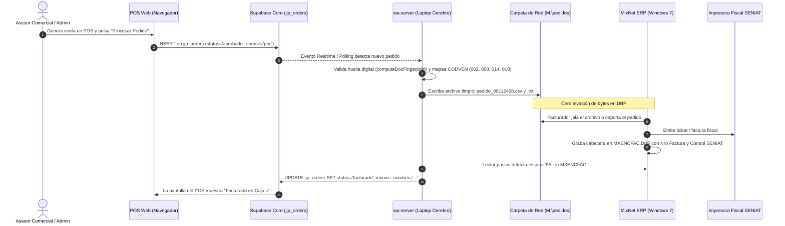
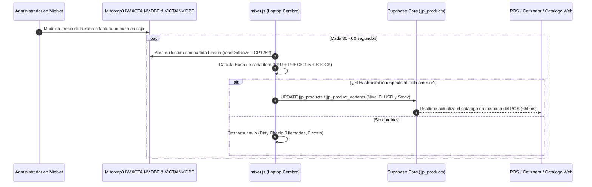
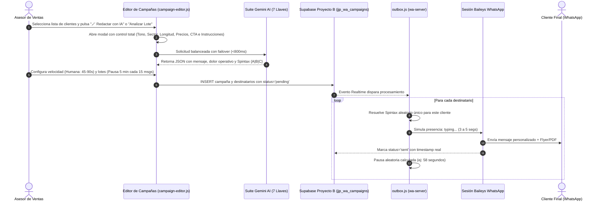

# 📘 ARQUITECTURA TOTAL Y GUÍA OPERATIVA DEL SISTEMA — JJ PAPER C.A.

> **Documento Maestro de Ingeniería, Integración y Prevención de Fallas**  
> *Fecha de consolidación: Octubre 2026*  
> *Ámbito: Frontend Web, Nube Multi-Proyecto Supabase, Servidor Local ("Cerebro"), Puente Windows 7 (MixNet ERP), Suite Gemini IA y Canales de Comunicación.*

---

## 📑 Índice General
1. [Visión Global y Topología de Red](#1-visión-global-y-topología-de-red)
2. [Contraste Arquitectónico: Frontend vs. Backend vs. Nube](#2-contraste-arquitectónico-frontend-vs-backend-vs-nube)
3. [Flujos de Datos y Ciclos de Vida Completos](#3-flujos-de-datos-y-ciclos-de-vida-completos)
4. [El Puente con Windows 7 y MixNet ERP en Detalle](#4-el-puente-con-windows-7-y-mixnet-erp-en-detalle)
5. [Matriz Exhaustiva de Fallas: Causas, Diagnóstico y Prevención](#5-matriz-exhaustiva-de-fallas-causas-diagnóstico-y-prevención)
6. [Guía de Configuración Detallada por Componente](#6-guía-de-configuración-detallada-por-componente)
7. [Protocolos Operativos y de Mantenimiento](#7-protocolos-operativos-y-de-mantenimiento)

---

## 1. Visión Global y Topología de Red

El ecosistema de **JJ Paper** es un sistema **híbrido y desacoplado**. Combina la agilidad de una plataforma web moderna en la nube con la robustez y legalidad fiscal del sistema tradicional de facturación en caja (**MixNet ERP** en Windows 7).

### 🗺️ Diagrama Maestro de la Red y Servicios

```mermaid
flowchart TB
    subgraph INTERNET ["☁️ SERVICIOS NUBE (Públicos / SaaS)"]
        CF["Cloudflare Pages\n(Hosting Web Frontend)\nRepo: kaddexomg/JJ-PAPER"]
        
        subgraph SUPABASE ["Supabase Multi-Proyecto"]
            S_CORE[("Proyecto A: Core (wwcdxqpib...)\n• jjp_products / variants\n• jjp_customers / prospects\n• jjp_orders / quotes\n• jjp_profiles / sellers")]
            S_COMM[("Proyecto B: Comunicación (klcibjwle...)\n• jjp_wa_sessions / chats / msgs\n• jjp_wa_campaigns / targets\n• jjp_emails / campaigns\n• jjp_server_control (Heartbeat)")]
            S_STOR[("Proyecto C: Storage (nmcamjxhy...)\n• Catálogo WebP optimizado\n• Comprobantes y PDF")]
        end
        
        GEMINI["Google Gemini AI API\n(Pool de 7 API Keys rotativas)\nModelos: 3.1-flash-lite / 3.6-flash"]
        GMAIL["Google Gmail API\n(OAuth2 por Vendedor)"]
    end

    subgraph CLIENTS ["💻 CLIENTES FRONTEND (Navegadores Web / Móvil / PWA)"]
        ADMIN_WEB["Panel Administrador (/admin/)\nPOS, Cotizador, CRM, Campañas, Monitor"]
        VEND_WEB["Panel Vendedor (/vendedor/)\nPOS, Cotizador, Difusiones, Catálogo"]
        PUB_WEB["Tienda y Catálogo Público\n(/catalogo.html, /checkout.html)"]
    end

    subgraph OFICINA ["🏢 RED LOCAL DE LA EMPRESA (LAN 192.168.0.0/24)"]
        subgraph LAPTOP_CEREBRO ["💻 LAPTOP CEREBRO / SUPERVISOR (192.168.0.172)"]
            SRV_MUTEX["Candado de Mutex (Puerto 127.0.0.1:8786)\nEvita Doble Instancia"]
            WA_NODE["wa-server (Node.js ESM en segundo plano)\nPID persistente bajo Windows Session Manager"]
            BAILEYS["Motor Baileys (WhatsApp Multi-Sesión)\nWebSockets directos con Meta"]
            OUTBOX["Motor Outbox & Despacho Throttled\n(Delays humanos, Spintax, Lotes)"]
            MIXER_BRIDGE["Puente Bidireccional Mixer (mixer.js)\nLectura DBF / Escritura de Pedidos"]
            LAN_API["Servidor HTTP LAN (:8787 / :8788)\nMonitor y API Offline de Pedidos"]
        end

        subgraph WIN7_FACTURACION ["🖥️ PC FACTURACIÓN (Windows 7 - 192.168.0.185)"]
            MIXNET_APP["MixNet ERP (Clipper / Harbour)\nFacturador de Tienda y Cajas"]
            UNIDAD_M[("Carpeta Compartida SMB\nM:\comp01 o \\192.168.0.185\comp01\n• MXCTAINV.DBF (Catálogo/Precios)\n• VICTAINV.DBF (Stock físico)\n• MXENCPED / MXRENPED (Pedidos)\n• MXENCFAC (Facturas fiscales SENIAT)\n• Archivos de Índices .NTX")]
            BANDEJA_EXP["Bandeja de Intercambio\nM:\mixnet o M:\pedidos\n(Archivos .csv / .txt)"]
            FISCAL["Impresora Fiscal SENIAT"]
        end
    end

    %% Conexiones Clientes Web
    CF --> ADMIN_WEB & VEND_WEB & PUB_WEB
    ADMIN_WEB & VEND_WEB -->|REST / PostgREST| S_CORE
    ADMIN_WEB & VEND_WEB -->|Realtime WebSockets| S_COMM
    ADMIN_WEB & VEND_WEB -->|Imágenes WebP| S_STOR
    ADMIN_WEB & VEND_WEB -->|IA Directa con balanceo| GEMINI

    %% Conexiones Laptop Servidor
    WA_NODE <-->|REST & Realtime| S_COMM
    WA_NODE <-->|REST (Pedidos/Stock)| S_CORE
    WA_NODE -->|OAuth2 Tokens| GMAIL
    BAILEYS <-->|TLS WebSockets| INTERNET
    
    %% Conexiones LAN Interna
    MIXER_BRIDGE <-->|Lectura Binaria DBF (CP1252)| UNIDAD_M
    MIXER_BRIDGE -->|Exporta pedido_NUM.csv| BANDEJA_EXP
    BANDEJA_EXP -->|Carga de Pedidos| MIXNET_APP
    MIXNET_APP --> FISCAL
    ADMIN_WEB -.->|Consulta Estado LAN| LAN_API
```

---

## 2. Contraste Arquitectónico: Frontend vs. Backend vs. Nube

Para entender el sistema, es indispensable saber **dónde se ejecuta cada cosa** y qué tecnología la respalda:

| Apartado | ¿Dónde corre? | Tecnologías Clave | Responsabilidad Primaria | ¿Qué hace si el otro nodo se cae? |
| :--- | :--- | :--- | :--- | :--- |
| **Frontend Web** | Navegador del usuario (PC, Laptop, Teléfono). Servido desde Cloudflare Pages CDN. | HTML5, CSS3, JavaScript Vanilla (ES6 Modules), Canvas API. | Interfaz de venta (POS), Cotizador, Catálogo, CRM de WhatsApp y Correo, visualización y generación gráfica de Flyers. | Si la laptop local se apaga, la web sigue funcionando: puede registrar cotizaciones y pedidos en la nube Supabase. |
| **Backend Nube (Supabase)** | Infraestructura gestionada en la nube (AWS / PostgREST / GoTrue / PostgreSQL). | PostgreSQL 15, Realtime CDC (Logical Decoding), Storage S3, RLS. | Base de datos relacional multi-proyecto, autenticación Google OAuth, almacenamiento de imágenes y suscripciones en tiempo real. | Almacena y encola todo. Si la laptop o el internet de la oficina caen, los datos permanecen seguros e inmutables en la nube. |
| **Backend Local ("Cerebro" / wa-server)** | Laptop Supervisor (`192.168.0.172`) o PC Servidor en segundo plano permanente. | Node.js (v20+ ESM), Baileys (Signal Protocol), Mutex Local, SMB File System. | Mantiene vivas las sesiones de WhatsApp, ejecuta envíos masivos con pausas anti-baneo, envía emails vía Gmail API, lee los `.DBF` de MixNet y exporta pedidos. | Si la nube tiene micro-cortes, el servidor reintenta automáticamente con backoff exponencial y mantiene cola local. |
| **Sistema MixNet ERP** | PC Facturación con Windows 7 (`192.168.0.185`). | Clipper 5.2 / Harbour, dBase III (`.DBF`), Índices B-Tree (`.NTX`). | Facturación fiscal con máquina fiscal SENIAT, inventario legal de tienda y cálculo de nómina de vendedores por `CODVEN`. | Trabaja de forma autónoma en la tienda física aunque no haya internet en toda la oficina. |

---

## 3. Flujos de Datos y Ciclos de Vida Completos

### 3.1. Flujo de Pedidos: Desde la Web hasta la Factura Fiscal



### 3.2. Flujo de Inventario y Precios: Desde MixNet hasta el Catálogo Web



### 3.3. Flujo de Campañas de WhatsApp con IA y Anti-Baneo



---

## 4. El Puente con Windows 7 y MixNet ERP en Detalle

### 4.1. Naturaleza Técnica de MixNet (Clipper 16/32 bits)
MixNet no posee API REST ni sockets TCP. Es un ejecutable compilado en **xBase (Clipper/Harbour)** diseñado en los años 90-2000. Opera mediante **bloqueo de archivos y rangos de bytes en disco (`M:\comp01`)**:
- **Almacenamiento:** Tablas `.DBF` (dBase III).
- **Indexación Crítica:** Archivos `.NTX`. Son árboles B-Tree binarios que mantienen el orden alfabético de clientes, productos y correlativos de facturación.

### 4.2. ¿Por qué está TERMINANTEMENTE PROHIBIDO escribir directo en los `.DBF`?
Durante el incidente del **29 de Septiembre de 2026**, se detectó que al insertar bytes directamente en `MXENCPED.DBF` desde Node.js:
1. El archivo de índices `MXENPEX*.NTX` **no se actualizó**, quedando ciego ante los nuevos registros.
2. La pantalla de facturación de MixNet en Windows 7 entró en **bucle infinito** intentando localizar punteros huérfanos.
3. Se generaron **registros fantasma repetidos en cascada** en las cajas de tienda.

> [!IMPORTANT]
> **REGLA MANDATORIA DE INTEGRACIÓN**:  
> La comunicación saliente hacia MixNet se realiza **exclusivamente por buzón de intercambio no invasivo** (`M:\pedidos\pedido_[NUM].csv` y `.txt`), o mediante el micro-conector nativo en Harbour que actualiza simultáneamente tablas e índices `.NTX`. La lectura desde MixNet (`MXCTAINV`, `VICTAINV`, `MXENCFAC`) es **100% pasiva y segura** en modo `fs.openSync(path, 'r')`.

### 4.3. Mapeo de Vendedores y Nómina Sagrada (`CODVEN`)
MixNet liquida comisiones sumando las ventas agrupadas por el código `CODVEN`. Está terminantemente prohibido alterar este valor:

| `CODVEN` en MixNet | Vendedor en JJ Paper | Rol y Cartera |
| :---: | :--- | :--- |
| **`002`** | **Luis Alarcón** | Cartera de calle y mayorista. |
| **`004` / `006`** | **Yovanni Araujo** | Cartera institucional y corporativa. |
| **`005`** | **Mostrador / Tienda Física** | **Exclusivo ventas presenciales en mostrador.** Jamás asignar por defecto. |
| **`008`** | **Marianela** | Cartera asignada Marianela08. |
| **`010`** | **Keyder Salazar** | Cartera propia Zona 010 (191 clientes exclusivos). |
| **`020`** | **Keyder Salazar (Admin)** | Cartera general MixNet Zona 020 (3.474 clientes). |
| **`014`** | **Andreina** | Cartera asignada Andreina. |

---

## 5. Matriz Exhaustiva de Fallas: Causas, Diagnóstico y Prevención

Esta matriz cubre todos los puntos críticos del sistema, el grado de probabilidad de falla y la contramedida exacta para neutralizarlos:

| # | Componente en Riesgo | Escenario de Falla | Probabilidad | Impacto | Causa Raíz | Diagnóstico Rápido | Prevención y Solución Definitiva |
| :-: | :--- | :--- | :---: | :---: | :--- | :--- | :--- |
| **1** | **Laptop Cerebro** | La laptop se suspende o apaga la pantalla. | **Alta** (si no se configura) | 🔴 Crítico | Configuración de fábrica de Windows apaga Wi-Fi/Ethernet al cerrar la tapa. | WhatsApp no responde; campañas programadas no salen; panel LAN da timeout. | En Opciones de Energía: poner **"Al cerrar la tapa: No hacer nada"** y **"Suspender: Nunca"**. Conectar cargador fijo. |
| **2** | **Red LAN Local** | Cambio de IP privada por DHCP del router. | **Media** (50%) | 🟠 Alto | El router se reinició y asignó a la laptop `192.168.0.145` en lugar de `.172`. | La PC Windows 7 no encuentra la laptop; monitores offline `:8787` no cargan. | Configurar **DHCP Reservation (IP fija por MAC)** en el router para la laptop en `192.168.0.172`. |
| **3** | **Unidad M: (MixNet)** | Desconexión de la carpeta compartida en red. | **Media** (40%) | 🟠 Alto | La PC Windows 7 se apagó, reinició, o el switch de red parpadeó. | El log de `mixer.js` indica `ENOENT: M:\comp01\MXCTAINV.DBF`. Precios no sincronizan. | `mixer.js` incluye fallback a rutas UNC directas (`\\192.168.0.185\comp01`). Si la PC Win7 reinicia, el puente reconecta en 5s. |
| **4** | **WhatsApp Baileys** | Error criptográfico "Bad MAC" / Desconexión. | **Baja** (2%) | 🔴 Crítico | Ocurría por **doble instancia de Node simultánea** compitiendo por los mismos tokens de cifrado. | Bucle de reconexión cada 2s en logs; WhatsApp pide escanear QR nuevamente. | **Mutex implementado en puerto local :8786**: si una segunda instancia intenta arrancar, aborta al instante con exit code 2. Cero duplicados. |
| **5** | **WhatsApp Meta** | Bloqueo o baneo de la línea por spam masivo. | **Baja** (con reglas activas) | 🔴 Crítico | Enviar ráfagas idénticas a prospectos fríos en menos de 5 segundos. | WhatsApp Web muestra "Número suspendido". | **Algoritmo de 4 capas**: 1) Spintax dinámico obligatorio `{A|B|C}`, 2) Lotes de 15 msgs con pausa de 5 min, 3) Delays humanos (45-90s), 4) Cooldown de 48h. |
| **6** | **Google Gemini IA** | Error 429 (Cuota excedida) o 503 (Servicio ocupado). | **Media** (en picos) | 🟡 Medio | Límites de peticiones por minuto en la cuenta de Google AI Studio. | Modal de IA muestra error o botón queda en "Cargando...". | **Pool de 7 API Keys rotativas** en `gemini-client.js`. Ante un error 429 conmuta de clave en <50ms; ante 503 conmuta de modelo a `flash-lite`. |
| **7** | **OAuth Gmail API** | Token de correo expirado o revocado. | **Media** (cada 6 meses) | 🟡 Medio | Google invalida tokens de aplicaciones de prueba si no se usan periódicamente. | Fallo al enviar campañas de correo o bandeja no lista correos entrantes. | Renovación con un clic en `admin/correo.html` usando el flujo nativo de autenticación de Google. |
| **8** | **Corte de Luz Oficina** | Apagón eléctrico general en la zona. | **Baja** (en laptop) | 🟡 Medio | Caída de energía comercial. | La laptop sigue encendida (batería), pero si el router cae, no hay red LAN ni internet. | Conectar el módem de fibra y el router principal a un **Mini-UPS de 12V DC** (da 4 a 6 horas de autonomía). |

---

## 6. Guía de Configuración Detallada por Componente

### 6.1. Configuración de la Laptop Cerebro (`wa-server`)
El servidor debe operar de forma totalmente desacoplada del terminal.
- **Ruta de instalación:** `C:\Users\PC\Desktop\JJ PAPER\wa-server`
- **Arranque invisible persistente:**
  ```powershell
  Start-Process wscript.exe -ArgumentList "start-hidden.vbs" -WorkingDirectory "C:\Users\PC\Desktop\JJ PAPER\wa-server"
  ```
  Esto inicia `run-service.bat` bajo el Administrador de Sesiones de Windows sin ventanas negras visibles, con salida de logs rotativa en `logs\wa-server.log`.
- **Variables de entorno (`wa-server/.env`):**
  ```ini
  PORT=8787
  PORT_COUNT=8788
  MUTEX_PORT=8786
  SUPABASE_URL=https://wwcdxqpibequfohbgejs.supabase.co
  SUPABASE_SERVICE_ROLE_KEY=eyJhbGciOi...
  COMM_SUPABASE_URL=https://klcibjwleiqppedefpxw.supabase.co
  COMM_SUPABASE_SERVICE_ROLE_KEY=eyJhbGciOi...
  MIXNET_DIR=M:/comp01
  MIXNET_EXPORT_DIR=M:/pedidos
  ```

### 6.2. Configuración en la PC Windows 7 (MixNet ERP)
- **Ruta física de datos:** `C:\comp01`
- **Compartir en Red:**
  - Clic derecho en `C:\comp01` ➔ *Propiedades* ➔ *Compartir* ➔ *Uso compartido avanzado*.
  - Nombre del recurso: `comp01`
  - Permisos: `Todos` / `Control Total` (Lectura y Escritura).
- **Carpeta de Intercambio:** Crear `C:\pedidos` y compartirla como `pedidos` para recibir las órdenes de venta.

### 6.3. Configuración del Frontend (`assets/js/config.js`)
El enrutador multi-proyecto de JJ Paper dirige automáticamente el tráfico:
```javascript
// Canales de comunicación hacia Proyecto B
if (table.startsWith('jjp_wa_') || table.startsWith('jjp_email') || table === 'jjp_server_control') {
  return window.COMM_SUPABASE_CLIENT;
}
// Todo lo demás (catálogo, precios, clientes, órdenes) hacia Proyecto A (Core)
return window.CORE_SUPABASE_CLIENT;
```

---

## 7. Protocolos Operativos y de Mantenimiento

### 7.1. Chequeo Rápido Matutino (30 Segundos)
1. Abrir en el navegador de la laptop o de cualquier PC: `http://192.168.0.172:8787/lan/monitor`
2. Verificar que los 3 semáforos estén en verde:
   - 🟢 **Servidor Activo (Heartbeat < 30s)**
   - 🟢 **WhatsApp Conectado (Sesiones Vendedores)**
   - 🟢 **Enlace MixNet OK (Ruta M:\comp01 accesible)**

### 7.2. ¿Qué hacer si se cambia la laptop o se reinicia el sistema?
1. Encender la laptop y conectar el cable de red.
2. Comprobar que en el Explorador de Windows la unidad `M:\` abra la carpeta de MixNet sin pedir contraseña.
3. Hacer doble clic en el archivo `wa-server\start-hidden.vbs`. El sistema queda 100% operativo en segundo plano.

### 7.3. Protección de Nómina y Comisiones
Antes de emitir reportes quincenales de comisiones:
- Comprobar que ningún pedido en `jjp_orders` tenga `seller_id` huérfano.
- Los pedidos de mostrador en tienda física pertenecen exclusivamente a `005` (Jose).
- Las ventas de calle y carteras asignadas pertenecen a `002` (Luis Alarcón), `004/006` (Yovanni), `008` (Marianela), `014` (Andreina) y `010/020` (Keyder Salazar).

---
*Fin del Manual Maestro de Arquitectura y Operación — JJ Paper C.A.*
