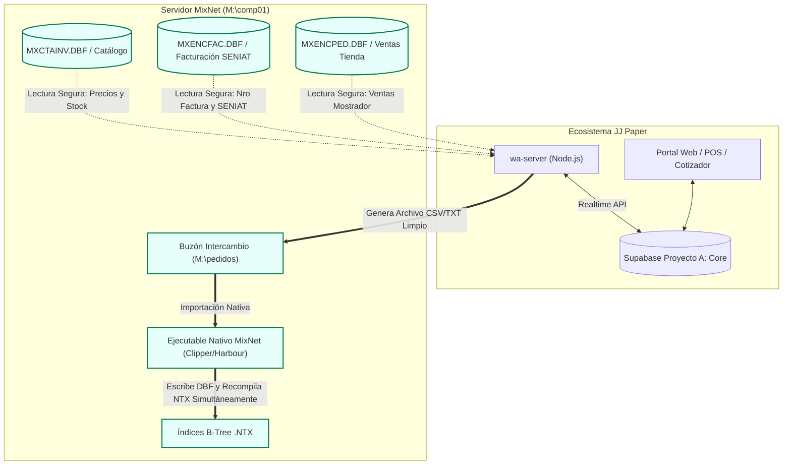

# Arquitectura, Estructura y Comportamiento de MixNet ERP

> **Documento Maestro de Integración JJ Paper ⇄ MixNet**  
> *Fecha de consolidación: 29 de Septiembre de 2026*  
> *Propósito: Establecer las especificaciones técnicas definitivas, el modelo de datos, la gestión de índices Clipper `.NTX`, el mapeo de vendedores para nómina y los protocolos estrictos de escritura/lectura para evitar cualquier alteración o corrupción en MixNet.*

---

## 1. Naturaleza y Entorno de Ejecución de MixNet

MixNet es un sistema administrativo y de facturación basado en tecnología **xBase / Clipper / Harbour**, diseñado para redes locales (LAN) compartidas mediante el protocolo **SMB/Windows Sharing**:

- **Motor de Almacenamiento**: Tablas dBase III (`.DBF`) sin motor cliente/servidor SQL.
- **Acceso a Datos**: Cada terminal lee y bloquea registros directamente sobre la unidad de red compartida (`M:\comp01\` o `\\192.168.0.185\comp01\`).
- **Sistema de Indexación**: Archivos B-Tree compilados **`.NTX`** (`MXENPEX*.NTX`, `MXENCZX*.NTX`, `MXCTACLI*.NTX`, etc.).
- **Manejo de Concurrencia**: Bloqueo de archivos y rangos de bytes (`flock` / `byte-range locking`).

> [!CAUTION]
> **REGLA FUNDAMENTAL DE CLIPPER / `.NTX`**:  
> Toda modificación, inserción o eliminación lógica de registros en un `.DBF` debe **actualizar simultáneamente sus archivos de índice `.NTX` correspondientes**.  
> **Escribir directamente en un `.DBF` con scripts externos (Node.js, Python, C) sin abrir y recomponer los archivos `.NTX` corrompe los árboles de punteros.** Esto ocasiona que las pantallas de MixNet entren en bucle, repitan registros fantasmas en cascada y desorganicen los reportes de facturación y nómina.

---

## 2. Mapa Maestro de Tablas `.DBF` en `M:\comp01\`

| Archivo DBF | Módulo | Función en MixNet | Operación Permitida desde JJ Paper |
| :--- | :--- | :--- | :--- |
| **`MXCTAINV.DBF`** | Inventario | Catálogo maestro de productos, precios 1 al 5 y stock | **Solo Lectura** (Sincroniza catálogo a web) |
| **`MXENCFAC.DBF`** | Facturación | Cabecera de facturas fiscales emitidas | **Solo Lectura** (Concilia facturas y SENIAT) |
| **`MXRENFAC.DBF`** | Facturación | Renglones de facturas fiscales | **Solo Lectura** (Desglose fiscal) |
| **`MXENCPED.DBF`** | Ventas | Cabeceras de pedidos de tienda y vendedores | **Solo Lectura** (Lectura de ventas de tienda) |
| **`MXRENPED.DBF`** | Ventas | Renglones y detalle de pedidos | **Solo Lectura** (Ítems y cantidades) |
| **`MXENCCOT.DBF`** | Presupuestos | Cabeceras de cotizaciones y presupuestos | **Solo Lectura** (Histórico de presupuestos) |
| **`MXRENCOT.DBF`** | Presupuestos | Renglones de cotizaciones | **Solo Lectura** |
| **`MXCTACLI.DBF`** | Clientes | Maestro de clientes, direcciones, teléfonos y vendedores | **Solo Lectura** |
| **`MXNUMPED.DBF`** | Control | Correlativo del próximo número de pedido | **Solo Lectura** |
| **`MXNUMCOT.DBF`** | Control | Correlativo de la próxima cotización | **Solo Lectura** |

---

## 3. Especificación Detallada de Campos Clave

### 3.1. Cabecera de Pedidos (`MXENCPED.DBF`)
- **`NUMPED` (Character, 8)**: Correlativo numérico estricto con ceros a la izquierda (ej. `00112468`). No permite prefijos alfanuméricos como `PED-` ni `MIX-`.
- **`EMISION` (Date, 8)**: Fecha en formato `YYYYMMDD`.
- **`CLIENTE` (Character, 8)**: Código de cliente en `MXCTACLI` (ej. `008-872`).
- **`CODSUC` (Character, 2)**: Sucursal (típicamente espacio en blanco).
- **`CODVEN` (Character, 5)**: Código de vendedor en nómina (ej. `002`, `008`, `014`, `010`). **Crítico para nómina.**
- **`COMEN1` (Character, 35)**: Comentario de cabecera 1 (ej. `ANOTADO`, `MOTORIZADO`, `FACTURA 116310`).  
  *PROHIBIDO inyectar aquí leyendas de sistemas externos como `[MixNet Caja]` o números `COT-26...`.*
- **`COMEN2` (Character, 35)**: Comentario de cabecera 2.
- **`TOT_PED` (Numeric, 14.2)**: Total del pedido en dólares o bolívares según `MONEDA`.
- **`ESTATUS` (Character, 2)**: `PE` = Pendiente, `FA` = Facturado, `AN` = Anulado.
- **`CAMBIO` (Numeric, 12.4)**: Tasa de cambio oficial aplicada.
- **`MONEDA` (Character, 3)**: Moneda del documento (`US$` o `BS`).

### 3.2. Detalle de Pedidos (`MXRENPED.DBF`)
- **`ITEM` (Character, 15)**: Código SKU del producto en `MXCTAINV` (ej. `LI-PAFOC`).
- **`UNIDAD` (Character, 3)**: Unidad de medida (`UND`, `PQT`, `RES`, `CJA`).
- **`CANTIDAD` (Numeric, 14.3)**: Cantidad vendida con 3 decimales.
- **`DESCRIP` (Character, 50)**: Descripción del producto tal como se imprime en factura.
- **`NUMPED` (Character, 8)**: Enlace a la cabecera en `MXENCPED`.
- **`PRECIO` (Numeric, 17.2)**: Precio unitario.
- **`TOT_REN` (Numeric, 19.2)**: Subtotal del renglón (`PRECIO * CANTIDAD`).
- **`IVA` (Character, 1)**: `A` = Alícuota general (16%), `E` = Exento.
- **`CLIENTE` (Character, 8)**: Código del cliente receptor.
- **`CODVEN` (Character, 5)**: Debe coincidir exactamente con el `CODVEN` de la cabecera.

### 3.3. Maestro de Clientes (`MXCTACLI.DBF`)
- **`CODCLI` (Character, 8)**: Código único de cliente (ej. `001-028`, `008-369`).
- **`NOMCLI` (Character, 60)**: Razón social o nombre legal.
- **`CIF` (Character, 15)**: RIF o Cédula (ej. `J-12345678-9`).
- **`VENDEDOR` (Character, 5)**: Vendedor asignado al cliente en nómina.
- **`ZONA` (Character, 3)**: Zona comercial (`004`, `008`, `010`, `020`, etc.).
- **`OBSERVA` (Character, 60)**: Observaciones de despacho o crédito.

---

## 4. Mapeo Estricto de Vendedores y Nómina de MixNet

MixNet liquida comisiones agrupando las ventas directamente por el campo **`CODVEN`** en `MXENCPED` y `MXENCFAC`. Cualquier alteración en este código afecta de inmediato el salario y comisiones del personal:

| Código `CODVEN` | Asesor / Vendedor | Rol / Ámbito en Tienda y Calle |
| :---: | :--- | :--- |
| **`002`** | **Luis Alarcón** | Ventas al mayor y cartera de calle. |
| **`004` / `006`** | **Yovanni Araujo** | Vendedor institucional y de calle. |
| **`005`** | **Jose** | **Exclusivo mostrador/tienda física.** Jamás debe adjudicarse como vendedor por defecto ni asociarse a Keyder Salazar. |
| **`008`** | **Marianela** | Ventas y cartera asignada (Marianela08). |
| **`010`** | **Keyder Salazar** | Cartera exclusiva Zona 010 (191 clientes asignados a Keyder). |
| **`020`** | **Keyder Salazar** | Cartera general MixNet Zona 020 (Keyder admin). |
| **`014`** | **Andreina** | Ventas y cartera asignada. |
| **`032` / `033`** | **Auxiliares / Mostrador** | Cajas secundarias de tienda. |

---

## 5. Lecciones Aprendidas del Incidente (29/09/2026)

### 5.1. Causa Raíz
1. **Escritura Directa a Nivel de Bytes**: Se implementó una función (`dbfUpsertHeader` / `dbfAppend`) que escribía directamente sobre `MXENCPED.DBF` y `MXRENPED.DBF`. Al no actualizar los archivos `.NTX`, los punteros de los índices quedaron desalineados, provocando bucles en los browse de Clipper y mostrando registros repetidos en pantalla.
2. **Asignación Errónea a `005`**: Se asignó el código `005` como fallback a operaciones de Keyder Salazar (quien es estrictamente `010` y `020`). Esto atribuyó ventas a Jose en nómina.
3. **Bucle de Eco**: Un proceso saliente leyó pedidos previamente importados de MixNet desde Supabase y los volvió a inyectar en MixNet con comentarios `[MixNet Caja]`, duplicando más de 130 pedidos correlativos.

### 5.2. Purga y Normalización Realizada
- **138 pedidos inyectados** en `MXENCPED` fueron marcados como borrados (`0x2A` / `'*'`).
- **790 renglones** en `MXRENPED` fueron marcados como borrados.
- **12 cotizaciones inyectadas** en `MXENCCOT` fueron marcadas como borradas.
- **78 renglones** en `MXRENCOT` fueron marcados como borrados.
- **`MXCTACLI`**: Se restauraron los códigos de vendedor de los clientes tocados (`008` Marianela, `002` Luis Alarcón).
- **Copias de seguridad**: Quedaron respaldadas en `M:\comp01\backups\CLEAN_PURGE_*.DBF`.

---

## 6. Procedimiento Obligatorio de Reindexación en MixNet

Cada vez que se realiza mantenimiento o depuración en las tablas `.DBF`:
1. Abrir MixNet en la estación principal o servidor.
2. Ir al menú superior: **`Mantenimiento` ➔ `Reindexar Archivos` (u `Organizar Archivos`)**.
3. MixNet recorrerá las tablas, **ignorará todos los registros marcados como borrados (`*`)** y generará archivos `.NTX` 100% limpios y equilibrados.
4. Las pantallas, reportes de nómina y estados de cuenta reflejan de inmediato únicamente los registros activos legítimos.

---

## 7. Arquitectura de Conexión Segura Definitiva

### Reglas de Oro de Implementación en Código:
1. **PROHIBIDO Escribir Binariamente en DBF**: Las funciones `exportOrderToDbf` y `exportQuoteToDbf` deben permanecer desactivadas (`return { ok: false, reason: 'dbf-direct-write-disabled-for-safety' }`).
2. **Filtro Anti-Bucle Obligatorio**: Todo barrido y listener Realtime debe descartar de inmediato registros con `source === 'mixnet'`, números `MIX-*` o notas que contengan `[MixNet`.
3. **Canal de Salida No Invasivo**: La comunicación hacia MixNet se realiza mediante archivos estructurados depositados en carpetas de buzón (`pedido_00112468.csv` y `.txt`), dejando que el motor nativo de MixNet sea el único que escriba e indexe sus tablas.
