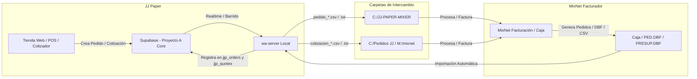

# Guía de Conexión y Configuración: Servidor Local ⇄ MixNet / Mixer

Esta guía detalla el funcionamiento del puente bidireccional entre el servidor local (`wa-server`) y el facturador local **MixNet / Mixer** para la sincronización fluida de pedidos y cotizaciones de **JJ Paper**.

---

## 🗺️ Diagrama del Flujo de Datos Bidireccional



---

## 🔄 Funcionamiento Bidireccional

### 1. JJ Paper ➔ MixNet (Exportación Automática)
* **Pedidos (`jjp_orders`)**: Cada pedido creado en el POS, Cotizador o Tienda Web se escribe al instante como `pedido_[NUMERO].csv` y `pedido_[NUMERO].txt`.
* **Cotizaciones (`jjp_quotes`)**: Cada cotización se escribe como `cotizacion_[NUMERO].csv` y `cotizacion_[NUMERO].txt`.
* **Espejo Multi-Carpeta**: Los archivos no se limitan a una sola ruta fija; el servidor detecta todas las carpetas disponibles (`C:\JJ-PAPER-MIXER`, `C:\Pedidos JJ`, `C:\Cotizaciones JJ`, `M:\mixnet`, etc.) y deposita los archivos en todas para que cualquier terminal de facturación o caja pueda leerlos.
* **Historial Anti-Duplicados**: Se registra en `wa-server/exported-orders.json` y `wa-server/exported-quotes.json` para no re-escribir pedidos que MixNet ya haya eliminado tras procesar.

### 2. MixNet ➔ JJ Paper (Importación Automática)
* **Archivos Planos de Caja**: El servidor vigila las carpetas de intercambio cada 30 segundos. Cualquier archivo CSV generado por Caja o terminales de MixNet (ej. `caja_*.csv`, `ped_*.csv`, `factura_*.csv`, etc.) es parseado e importado automáticamente a `jjp_orders` o `jjp_quotes`.
* **Conexión Directa DBF**: Si la unidad de red `M:\comp01` está conectada, el servidor lee directamente las tablas `PED.DBF` y `PRESUP.DBF` de MixNet sin necesidad de exportaciones manuales.
* **Asignación Inteligente de Vendedor**: Al importar desde MixNet, el sistema cruza el RIF, teléfono o nombre del cliente contra la base de datos `jjp_customers`. Si el cliente pertenece a la cartera de un vendedor específico (ej. Marianela, Yovanni, Andreina, Keyder), la orden se asigna a su cuenta automáticamente.

---

## 🚀 Inicio Automático y Segundo Plano (Windows 7 / 10 / 11)

El servidor está preparado para funcionar **100% en segundo plano** sin molestas ventanas negras de consola y sin riesgo de que los operadores lo cierren por accidente.

### 1. Instalación en 1 Clic
1. En la PC del servidor (`Supervisor-Pc`), abre la carpeta `wa-server`.
2. Haz doble clic en:
   ```text
   INSTALAR-INICIO-AUTOMATICO.bat
   ```
3. El configurador creará el enlace silencioso en la carpeta de inicio de Windows (`shell:startup`) y una tarea programada en Windows.
4. **Listo**: El servidor arrancará automáticamente cada vez que se encienda la PC o inicie sesión.

### 2. Ver Estado del Servidor
Para verificar si el servidor está activo, su consumo de RAM y el estado de conexión con MixNet:
* Haz doble clic en:
  ```text
  ESTADO-SERVIDOR.bat
  ```
  Mostrará en pantalla:
  * 🟢 Estado en línea / PID del proceso Node / Uso de memoria RAM.
  * 🌐 Enlace del Monitor Web LAN y endpoints locales.
  * 📁 Rutas activas de MixNet y base de datos DBF.
  * 📜 Últimas 15 líneas del registro `logs\wa-server.log`.

### 3. Detener o Reiniciar
* **Reiniciar**: Doble clic en `REINICIAR-SERVIDOR.bat`.
* **Detener**: Doble clic en `DETENER-SERVIDOR.bat` (o botón "⏹️ Detener" en el panel web).

---

## 🌐 Endpoints de Red LAN Local

Para sistemas o terminales que prefieran consumir datos vía HTTP en la red local:
* **Monitor Web**: `http://192.168.0.172:8787/lan/monitor`
* **Pedidos Recientes (JSON)**: `http://192.168.0.172:8787/lan/mixnet/pedidos`
* **Pedidos Recientes (CSV)**: `http://192.168.0.172:8787/lan/mixnet/pedidos?format=csv`
* **Cotizaciones Recientes (JSON)**: `http://192.168.0.172:8787/lan/mixnet/cotizaciones`
* **Cotizaciones Recientes (CSV)**: `http://192.168.0.172:8787/lan/mixnet/cotizaciones?format=csv`
