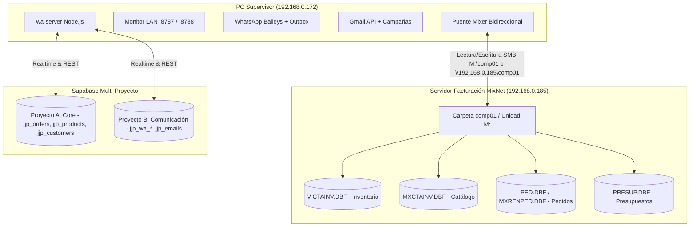

# Guía de Conexión y Configuración: Servidor Local ⇄ MixNet / Mixer

Esta guía detalla la arquitectura de red y el funcionamiento del puente bidireccional entre el servidor de JJ Paper (`wa-server`) en la PC Supervisor y el facturador **MixNet** en la empresa.

---

## 🗺️ Topología de Red de la Empresa

---

## 🔄 Funcionamiento Bidireccional Completo ("Un Solo Cuerpo")

### 1. Pedidos (JJ Paper ⇄ MixNet)
* **JJ Paper ➔ MixNet**:
  * Cada pedido aprobado en la Web, POS o Cotizador se registra en `jjp_orders` con su número correlativo real de 8 dígitos (ej. `00112468`).
  * El puente exporta de inmediato `pedido_[NUMERO].csv` y `pedido_[NUMERO].txt` a las carpetas compartidas (`M:\comp01`, `M:\pedidos`, etc.) y escribe nativamente en `MXENCPED.DBF` y `MXRENPED.DBF`.
  * **Modo Edición In-Place**: Si un vendedor o administrador modifica un pedido existente desde el POS (`pos.html?order=00112468`):
    - `upsertDbfHeader` sobrescribe en su posición exacta de bytes el registro en `MXENCPED.DBF` sin alterar el archivo ni duplicar.
    - `replaceDbfDetails` actualiza los renglones en `MXRENPED.DBF`, marcando renglones suprimidos con `0x2A` ('*') de dBase III y anexando líneas nuevas si aumentaron.
    - **`MXNUMPED.DBF` y `jjp_settings` NO se incrementan**; el número del pedido se mantiene idéntico.
  * Huella digital determinista (`computeDocFingerprint`) previene bucles de eco entre sistemas.
* **MixNet ➔ JJ Paper**:
  * El servidor vigila las tablas `MXENCPED.DBF` y `MXRENPED.DBF` cada 30 segundos.
  * Si un pedido es creado o editado en MixNet, actualiza el registro en `jjp_orders` (`UPDATE` sobre el mismo `id`), sincronizando montos, ítems y cliente.

### 2. Cotizaciones y Presupuestos (JJ Paper ⇄ MixNet)
* **JJ Paper ➔ MixNet**:
  * Cada cotización de vendedor se deposita como `cotizacion_[NUMERO].csv` y `.txt`, y se escribe en `MXENCCOT.DBF` y `MXRENCOT.DBF` con serial correlativo real de 8 dígitos (ej. `00053327`).
  * Si se edita desde el Cotizador (`cotizador.html?edit=00053327`), se actualiza en lugar en el DBF sin incrementar `MXNUMCOT.DBF`.
* **MixNet ➔ JJ Paper**:
  * Lectura periódica de presupuestos emitidos en MixNet para seguimiento de ventas en `jjp_quotes`.

### 3. Productos, Precios y Stock (JJ Paper ⇄ MixNet)
* **MixNet ➔ JJ Paper**:
  * Lee `VICTAINV.DBF` y `MXCTAINV.DBF` para actualizar en tiempo real el stock físico y los precios de venta en `jjp_products` y `jjp_product_variants`.
  * Respaldo HTTP: Si la suite de bajo consumo de `archivos-pc` está activa en el puerto 3000 (`http://192.168.0.185:3000`), el servidor sincroniza productos vía API REST.
* **JJ Paper ➔ MixNet**:
  * Sincroniza `catalogo_jjpaper.csv` y `productos_jjpaper.csv` directamente en la unidad de red.

---

## 🚀 Inicio Automático y Segundo Plano en `Supervisor-Pc`

El servidor está preparado para funcionar **100% en segundo plano** sin ventanas de consola visibles y con auto-reinicio ante errores:

1. **Instalación en la PC del Supervisor (`192.168.0.172`)**:
   * Ejecutar: `INSTALAR-INICIO-AUTOMATICO.bat` dentro de `wa-server`.
   * El servicio queda enlazado en `shell:startup` y arrancará con Windows.
2. **Supervisión de Salud**:
   * Auto-diagnóstico: si ocurre un fallo de red o socket, el servidor se reinicia automáticamente en 2 segundos.
   * Ejecutar `ESTADO-SERVIDOR.bat` para verificar PID, memoria RAM y rutas activas.

---

## 🌐 Endpoints de Red LAN Local (Disponibles en la red)

* **Monitor de Salud y Cuotas**: `http://192.168.0.172:8787/lan/monitor`
* **Pedidos Recientes (JSON)**: `http://192.168.0.172:8787/lan/mixnet/pedidos`
* **Pedidos Recientes (CSV)**: `http://192.168.0.172:8787/lan/mixnet/pedidos?format=csv`
* **Cotizaciones Recientes (JSON)**: `http://192.168.0.172:8787/lan/mixnet/cotizaciones`
* **Cotizaciones Recientes (CSV)**: `http://192.168.0.172:8787/lan/mixnet/cotizaciones?format=csv`
* **Catálogo de Productos para MixNet (JSON)**: `http://192.168.0.172:8787/lan/mixnet/productos`
* **Catálogo de Productos para MixNet (CSV)**: `http://192.168.0.172:8787/lan/mixnet/productos?format=csv`
* **Estado del Enlace MixNet**: `http://192.168.0.172:8787/lan/mixnet/status`
