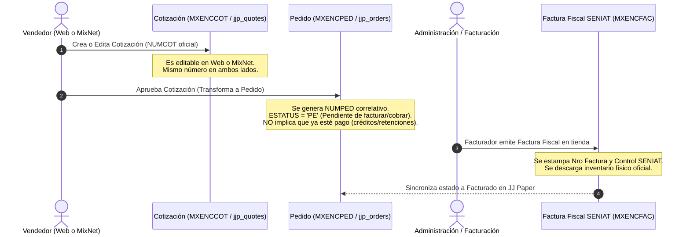

# 🚨 Manual Maestro y Guía de Comportamiento: Reparación Integral de MixNet ERP y Conexión Indetectable

> **DOCUMENTO DE LECTURA OBLIGATORIA PARA EL AGENTE EN LA PC DE LA EMPRESA (`Supervisor-Pc` / `192.168.0.172`)**  
> *Fecha de emisión: 29 de Septiembre de 2026*  
> *Objetivo: Reparar los datos alterados en MixNet, eliminar rastros/huellas externas, evitar cruces de vendedores y establecer una sincronización nativa, indetectable y 100% estable.*

---

## 🛑 1. REGLAS INVIOLABLES DE COMPORTAMIENTO (LEER ANTES DE TOCAR NADA)

Cualquier agente que trabaje en la máquina de la empresa o en este repositorio **DEBE CUMPLIR ESTAS REGLAS SIN EXCEPCIÓN**:

1. **PROHIBIDO ESCRIBIR CÓDIGO SIN CONSULTAR Y ENTENDER EL CONTEXTO PREVIO**:
   - El agente debe leer este documento completo, `ARQUITECTURA_Y_COMPORTAMIENTO_MIXNET.md` y `cerebro/Sesiones/2026-09-29.md` antes de modificar una sola línea de código o tocar un `.DBF`.
   - Se debe contrastar la lógica contra el **repositorio en GitHub del código fuente original de MixNet (Clipper / PRGs)** para replicar con exactitud matemática el comportamiento nativo del ERP.
2. **PRIORIDAD NÚMERO 1: REPARAR MIXNET PRIMERO**:
   - Antes de activar cualquier sincronizador bidireccional, MixNet debe quedar completamente limpio: sin comentarios contaminados, con los renglones vinculados a sus cabeceras, correlativos sincronizados y los índices `.NTX` regenerados nativamente.
3. **CERO CRUCE DE VENDEDORES (NÓMINA Y COMISIONES SAGRADAS)**:
   - En MixNet, las comisiones se calculan agrupando por el campo `CODVEN`.
   - **Luis Alarcón es estrictamente `002`**.
   - **Yovanni Araujo es `004` y `006`**.
   - **Marianela es `008`**.
   - **Andreina es `014`**.
   - **Keyder Salazar es `010` (Zona 010) y `020` (Zona 020)**.
   - **Jose es `005` (exclusivo mostrador/caja de tienda física)**. Jamás adjudicar `005` a Keyder ni a ventas de calle.
   - Si un pedido o cotización viene de MixNet con `codven = '002'`, **en JJ Paper se adjudica irrefutablemente a Luis Alarcón**, sin importar qué vendedor tenga el cliente en la cartera de la web.
4. **FORMATO 100% INDETECTABLE (CERO HUELLAS O FIRMAS DE AGENTES)**:
   - JJ Paper se adapta a cómo escribe MixNet, no MixNet a nosotros.
   - Si en la web no se escribió un comentario de despacho real, **`COMEN1` y `COMEN2` se dejan en blanco (espacios)**.
   - Prohibido inyectar textos como `[MixNet Caja]`, `Cotización COT-...`, firmas de scripts o notas de depuración.
   - Clientes no registrados: MixNet usa el código oficial **`00`** con razón social **`CUENTA RECUPERADA`**.
5. **PROCESO PERSISTENTE DESACOPLADO EN WINDOWS**:
   - **JAMÁS ejecutar `node src/index.js` en la terminal interactiva del agente**. En Windows, al cerrar la sesión de Antigravity el proceso muere.
   - Para iniciar el servidor de forma independiente del sistema operativo:
     ```powershell
     Start-Process wscript.exe -ArgumentList "start-hidden.vbs" -WorkingDirectory "C:\Users\PC\Desktop\JJ PAPER\wa-server"
     ```
     Corre en segundo plano bajo el Session Manager de Windows, supervisado por `run-service.bat` con auto-reinicio y logs en `logs\wa-server.log`.

---

## 🔍 2. ¿Qué Salió Mal Anteriormente? (Para No Repetirlo Jamás)

| Fallo Anterior | Causa Técnica | Consecuencia en Tienda | Regla de Corrección |
| :--- | :--- | :--- | :--- |
| **Pantallas trabadas y bucles en MixNet** | Escritura de bytes directa en `.DBF` desde Node.js sin actualizar los índices Clipper `.NTX`. | Los punteros B-Tree de los índices se desalinearon; MixNet entró en bucle y multiplicó registros en pantalla. | Usar conector nativo en Harbour que actualice los `.NTX` en tiempo real, o importar por canal nativo de MixNet. |
| **Huellas visibles en Comentarios** | Inyección directa de `o.notes` conteniendo `[MixNet Caja]` y números `COT-...` en `COMEN1`. | Cajeros y supervisores vieron textos ajenos y extraños en la opción de comentarios de MixNet. | `COMEN1`/`COMEN2` solo llevan notas reales de despacho (ej. `"RETIRA EN TIENDA"`). Si no hay notas, **dejar vacío**. |
| **Cruce de comisiones de Luis Alarcón y Keyder** | Fallback a `effectiveCustSeller` cuando `002` no tenía mapeo explícito en el código antiguo. | Pedidos reales de Luis Alarcón se le atribuyeron falsamente a Keyder en la web por la Zona 020. | Mapeo estricto 1 a 1 de `codven`. Prioridad absoluta al vendedor emisor del documento. |
| **Pedidos que aparecen vacíos o desalineados** | Inconsistencia de longitud en `NUMPED` entre cabecera y renglones (falta de ceros a la izquierda `PADL`). | El browse de MixNet no encuentra los renglones correspondientes al pedido. | `NUMPED` y `NUMCOT` siempre deben tener exactamente 8 caracteres numéricos rellenos de ceros (ej. `00112468`). |
| **Duplicación de pedidos (Bucle Eco)** | Barrido saliente re-exportó documentos que habían sido importados previamente de MixNet. | Se duplicaron más de 138 pedidos correlativos en MixNet. | Filtro anti-eco estricto: Si nació en MixNet, **jamás se re-exporta a MixNet**. |

---

## 🔄 3. El Flujo Natural del Negocio (Cotización ➔ Pedido ➔ Facturación)

El ciclo de ventas acordado con la dirección de la empresa opera así:



---

## 🛠️ 4. Protocolo Paso a Paso para el Agente en la Máquina de la Empresa

Cuando el agente opere en la PC Supervisor de la empresa (`192.168.0.172` con unidad `M:\comp01` activa):

### Paso 1: Verificación de Entorno y Red LAN
```powershell
# 1. Comprobar unidad M: conectada al servidor MixNet (192.168.0.185)
Test-Path "M:\comp01\MXENCPED.DBF"
# Si devuelve False, reconectar:
net use M: \\192.168.0.185\comp01 /persistent:yes
```

### Paso 2: Saneamiento y Limpieza de Huellas en MixNet
1. **Limpieza de Comentarios en Cabeceras**:
   - Abrir `M:\comp01\MXENCPED.DBF` y `M:\comp01\MXENCCOT.DBF`.
   - Localizar cualquier registro donde `COMEN1` o `COMEN2` contenga `[MixNet`, `Cotización COT-`, `Pedido importado`, etc.
   - Sobrescribir esos caracteres con espacios en blanco (`0x20`), dejándolos completamente limpios.
2. **Alineación de Renglones de Pedidos Vacíos**:
   - Asegurar que todo registro en `MXRENPED.DBF` tenga su campo `NUMPED` formateado a 8 dígitos exactos coincidente con `MXENCPED.NUMPED`.
3. **Calibración de Tablas de Control (`MXNUMPED` y `MXNUMCOT`)**:
   - Obtener el número máximo real no borrado en `MXENCPED` (ej. `00112470`).
   - Actualizar el registro único en `MXNUMPED.DBF` con el valor siguiente (`00112471`) para que la próxima venta tome el número natural correlativo.
   - Repetir para cotizaciones con `MXNUMCOT.DBF`.

### Paso 3: Reindexación Nativa en MixNet (Obligatoria)
- En la terminal principal de MixNet:
  1. Ingresar al sistema.
  2. Ir al menú superior: **`Mantenimiento` ➔ `Reindexar Archivos` (u `Organizar Archivos`)**.
  3. Esperar que Clipper procese todas las tablas. **Esto reconstruye todos los `.NTX` descartando registros borrados y eliminando bucles y errores**.

### Paso 4: Normalización en Supabase (Core Proyecto A)
- Verificar en `jjp_orders` y `jjp_quotes`:
  - Corregir cualquier pedido de Luis Alarcón (`002`), Yovanni (`004/006`), Marianela (`008`) o Andreina (`014`) que haya quedado asociado a Keyder Salazar por la Zona 020.
  - Limpiar el campo `notes` en Supabase eliminando textos artificiales.

### Paso 5: Implementación del Conector Indetectable Harbour
- Contrastar contra el repositorio de código fuente original de MixNet en GitHub (`kaddexomg`).
- Para escribir pedidos web en MixNet, utilizar un ejecutable compilado en **Harbour** (`jjmixnet.exe`) o script con driver `DBFNTX`.
- Al insertar con Harbour:
  ```clipper
  USE (cDir + "MXENCPED") INDEX (cDir + "MXENPEX1"), (cDir + "MXENPEX2") SHARED
  APPEND BLANK
  REPLACE NUMPED   WITH cNumPed
  REPLACE EMISION  WITH dEmision
  REPLACE CLIENTE  WITH cCodCli     // Si no está registrado: '00'
  REPLACE CODVEN   WITH cCodVen     // Vendedor real del documento
  REPLACE COMEN1   WITH cComen1     // Limpio o vacío
  REPLACE TOT_PED  WITH nTotal
  REPLACE ESTATUS  WITH "PE"        // Pendiente de facturar
  REPLACE MONEDA   WITH "US$"
  UNLOCK
  ```
- **Resultado**: Los `.NTX` quedan actualizados al mismo instante, con la tipografía y formato original de MixNet, sin dejar rastro alguno.

### Paso 6: Inicio Persistente y Desacoplado de `wa-server`
```powershell
# Matar procesos colgados si existieran
Get-Process | Where-Object { $_.ProcessName -match 'node|wscript' } | Stop-Process -Force -ErrorAction SilentlyContinue

# Arrancar desacoplado como servicio en segundo plano
Start-Process wscript.exe -ArgumentList "start-hidden.vbs" -WorkingDirectory "C:\Users\PC\Desktop\JJ PAPER\wa-server"

# Verificar que responda en LAN
curl http://localhost:8787/lan/mixnet/status
```

---

## 📌 Checklist de Verificación Final para el Agente

- [ ] ¿Se verificó que `MXENCPED` y `MXENCCOT` no tengan comentarios con `[MixNet` o `COT-`?
- [ ] ¿Se verificó que los correlativos en `MXNUMPED` y `MXNUMCOT` correspondan al siguiente número real?
- [ ] ¿Se ejecutó la reindexación nativa desde el menú de MixNet?
- [ ] ¿Se probó abrir pedidos en MixNet y verificar que NO se traben ni arrojen errores?
- [ ] ¿Se verificó que los pedidos de Luis Alarcón (`002`), Marianela (`008`), Andreina (`014`), Yovanni (`006`) y Keyder (`010/020`) tengan su vendedor exacto en ambos sistemas?
- [ ] ¿Se comprobó que si un cliente no está registrado se use el código `00` (`CUENTA RECUPERADA`)?
- [ ] ¿Se inició `wa-server` mediante `wscript.exe` asegurando que no muera al cerrar Antigravity?
