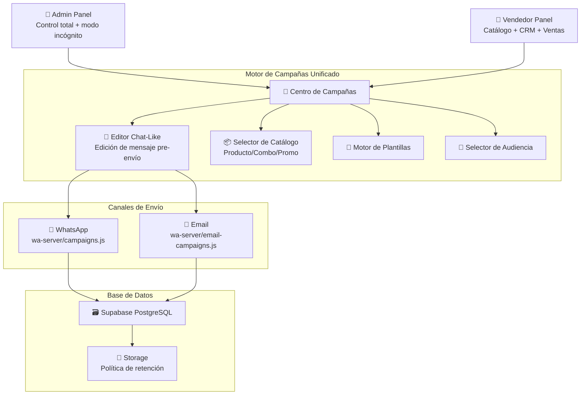
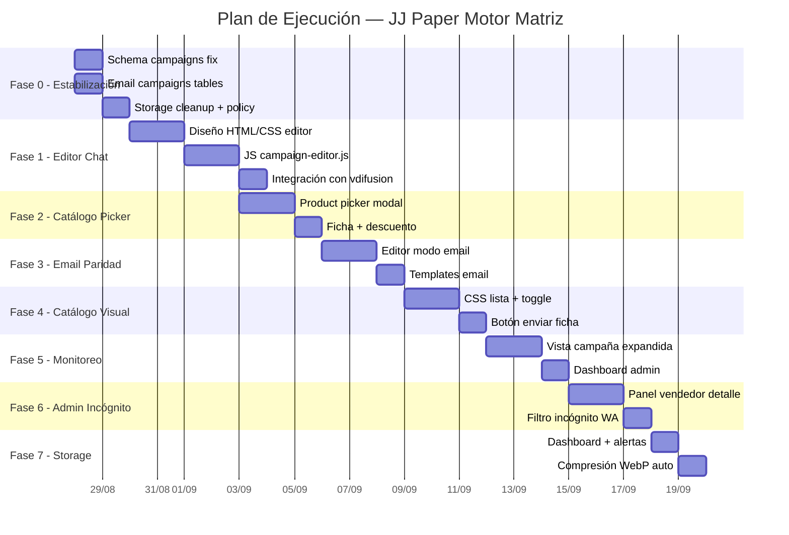

# 🏗️ PLAN DE GENERACIÓN MOTORA MATRIZ
## JJ Paper — Arquitectura de Integración Completa

> **Versión:** 1.0 · **Fecha:** 2026-08-27  
> **Alcance:** Campañas WhatsApp + Email, Catálogo Visual, Interfaz de Chat para Edición de Mensajes, Administración Avanzada, Optimización de Storage  
> **Regla de oro:** CERO crecimiento de storage innecesario. Cada byte debe justificarse.

---

## 📋 DIAGNÓSTICO DEL ESTADO ACTUAL

### Stack tecnológico vigente
| Componente | Tecnología | Estado |
|---|---|---|
| Frontend | HTML estático + Vanilla JS + Supabase SDK | ✅ Funcional |
| Base de datos | Supabase (PostgreSQL) — plan gratuito | ⚠️ Límite de storage |
| WhatsApp | wa-server local (Baileys) → Supabase Realtime | ✅ Funcional |
| Email | Gmail SMTP/OAuth2 vía wa-server/email.js | ✅ Funcional |
| Hosting | Netlify (static) + Vercel OIDC | ✅ Funcional |
| Campañas WA | jjp_wa_campaigns + campaign_targets + wa-server/campaigns.js | ⚠️ Bugs schema |
| Campañas Email | jjp_email_campaigns + email-campaigns.js | ⚠️ Tablas posiblemente faltantes |

### Problemas críticos identificados
1. **Schema de campañas desincronizado** — el frontend envía columnas que la BD no tiene (ya parcialmente documentado en `PLAN_REPARACION_BACKEND.md`)
2. **Storage al límite** — Supabase free tier: 1 GB. Buckets `jjp-wa-media`, `jjp-receipts`, `jjp-email-media` sin política de retención
3. **Campañas sin editor de chat** — el mensaje se previsualiza en texto plano, sin interfaz tipo WhatsApp para editar antes de enviar
4. **Catálogo con formato HTML cuadrado** — no parece un listado profesional de catálogo
5. **Sin flujo de selección de producto al elegir plantilla de promoción** — la ventana de catálogo no se abre automáticamente
6. **Campañas de email sin paridad con WhatsApp** — funcionalidad limitada en la interfaz
7. **Admin sin vista incógnita completa** de vendedores, clientes y campañas

### Tablas existentes relevantes (38+ tablas)
```
jjp_profiles          jjp_customers         jjp_products
jjp_product_variants  jjp_brands            jjp_categories
jjp_orders            jjp_quotes            jjp_promos
jjp_wa_campaigns      jjp_wa_campaign_targets
jjp_wa_templates      jjp_wa_chats          jjp_wa_messages
jjp_wa_sessions       jjp_email_accounts    jjp_emails
jjp_email_campaigns   jjp_email_campaign_targets
jjp_notifications     jjp_settings          ...
```

---

## 🏛️ ARQUITECTURA GENERAL DEL FLUJO



---

## 📐 PLAN POR FASES

---

### FASE 0: ESTABILIZACIÓN DE SCHEMA Y STORAGE (Semana 1)
> **Objetivo:** Eliminar todos los errores de schema que impiden que las campañas funcionen, y liberar storage para que no se caiga la BD.

#### 0.1 Reparación definitiva del schema de campañas WA

**Archivo:** `sql/FASE0_ESTABILIZACION.sql`

**Implementación exacta:**

```sql
-- 1. Expandir CHECK constraint de status para aceptar 'pending' y 'sending'
ALTER TABLE public.jjp_wa_campaigns 
  DROP CONSTRAINT IF EXISTS jjp_wa_campaigns_status_check;
ALTER TABLE public.jjp_wa_campaigns
  ADD CONSTRAINT jjp_wa_campaigns_status_check
  CHECK (status IN ('en_cola','pending','enviando','sending',
                    'pausada','completada','sent','cancelada'));

-- 2. Agregar columnas de media que el frontend envía
ALTER TABLE public.jjp_wa_campaigns
  ADD COLUMN IF NOT EXISTS created_by UUID,
  ADD COLUMN IF NOT EXISTS message TEXT,
  ADD COLUMN IF NOT EXISTS media_path TEXT,
  ADD COLUMN IF NOT EXISTS media_type TEXT DEFAULT 'text',
  ADD COLUMN IF NOT EXISTS media_mime TEXT,
  ADD COLUMN IF NOT EXISTS media_filename TEXT,
  ADD COLUMN IF NOT EXISTS media_size INTEGER;

-- 3. Expandir CHECK constraint de targets
ALTER TABLE public.jjp_wa_campaign_targets
  DROP CONSTRAINT IF EXISTS jjp_wa_campaign_targets_status_check;
ALTER TABLE public.jjp_wa_campaign_targets
  ADD CONSTRAINT jjp_wa_campaign_targets_status_check
  CHECK (status IN ('pending','en_cola','sent','enviado',
                    'failed','fallido','skipped','omitido'));
```

**En el frontend** (`vdifusion.js`), se eliminan las columnas duplicadas/innecesarias:
- Quitar `total_count` del payload (ya envía `total`)
- El campo `message` se mantiene como alias de `body` (la columna ya existirá)

#### 0.2 Verificación/Creación de tablas de email campaigns

**Comprobar si existen** `jjp_email_campaigns` y `jjp_email_campaign_targets`. Si no:

```sql
CREATE TABLE IF NOT EXISTS public.jjp_email_campaigns (
  id           UUID PRIMARY KEY DEFAULT gen_random_uuid(),
  owner_id     UUID NOT NULL REFERENCES public.jjp_profiles(id) ON DELETE CASCADE,
  name         TEXT NOT NULL,
  kind         TEXT NOT NULL DEFAULT 'general',
  subject      TEXT NOT NULL,
  body         TEXT NOT NULL,
  html         TEXT,
  attachments  JSONB DEFAULT '[]'::jsonb,
  status       TEXT NOT NULL DEFAULT 'pending'
               CHECK (status IN ('pending','running','paused','done','cancelled')),
  delay_min_s  INT NOT NULL DEFAULT 5,
  delay_max_s  INT NOT NULL DEFAULT 15,
  total        INT NOT NULL DEFAULT 0,
  sent_count   INT NOT NULL DEFAULT 0,
  failed_count INT NOT NULL DEFAULT 0,
  started_at   TIMESTAMPTZ,
  finished_at  TIMESTAMPTZ,
  created_at   TIMESTAMPTZ NOT NULL DEFAULT now(),
  updated_at   TIMESTAMPTZ NOT NULL DEFAULT now()
);

CREATE TABLE IF NOT EXISTS public.jjp_email_campaign_targets (
  id           UUID PRIMARY KEY DEFAULT gen_random_uuid(),
  campaign_id  UUID NOT NULL REFERENCES public.jjp_email_campaigns(id) ON DELETE CASCADE,
  owner_id     UUID NOT NULL,
  customer_id  UUID REFERENCES public.jjp_customers(id) ON DELETE SET NULL,
  to_addr      TEXT NOT NULL,
  name         TEXT,
  vars         JSONB NOT NULL DEFAULT '{}'::jsonb,
  status       TEXT NOT NULL DEFAULT 'pending'
               CHECK (status IN ('pending','sending','sent','failed','skipped')),
  email_id     UUID,
  error        TEXT,
  sent_at      TIMESTAMPTZ,
  created_at   TIMESTAMPTZ NOT NULL DEFAULT now()
);

-- Columna opt-out de email en customers
ALTER TABLE public.jjp_customers
  ADD COLUMN IF NOT EXISTS email_opt_out BOOLEAN NOT NULL DEFAULT false,
  ADD COLUMN IF NOT EXISTS last_email_at TIMESTAMPTZ;

-- RLS
ALTER TABLE public.jjp_email_campaigns ENABLE ROW LEVEL SECURITY;
ALTER TABLE public.jjp_email_campaign_targets ENABLE ROW LEVEL SECURITY;

CREATE POLICY ec_sel ON public.jjp_email_campaigns FOR SELECT TO authenticated
  USING (owner_id = auth.uid() OR public.jjp_is_admin());
CREATE POLICY ec_ins ON public.jjp_email_campaigns FOR INSERT TO authenticated
  WITH CHECK (owner_id = auth.uid());
CREATE POLICY ec_upd ON public.jjp_email_campaigns FOR UPDATE TO authenticated
  USING (owner_id = auth.uid()) WITH CHECK (owner_id = auth.uid());
CREATE POLICY ect_sel ON public.jjp_email_campaign_targets FOR SELECT TO authenticated
  USING (owner_id = auth.uid() OR public.jjp_is_admin());
CREATE POLICY ect_ins ON public.jjp_email_campaign_targets FOR INSERT TO authenticated
  WITH CHECK (owner_id = auth.uid());
```

#### 0.3 Política de retención de Storage — LA REGLA DE ORO

**Problema:** Supabase gratuito = 1 GB total de almacenamiento (datos + storage). Las imágenes de campañas, PDFs adjuntos y media de WhatsApp crecen sin control.

**Solución — Retención automática por cron + limpieza manual:**

```sql
-- Función de limpieza programada (ejecutar semanalmente o bajo demanda)
CREATE OR REPLACE FUNCTION public.jjp_storage_cleanup()
RETURNS TEXT LANGUAGE plpgsql SECURITY DEFINER AS $$
DECLARE
  v_wa     INT := 0;
  v_email  INT := 0;
  v_old    INT := 0;
BEGIN
  -- 1. Media de campañas WA completadas hace >7 días
  DELETE FROM storage.objects
  WHERE bucket_id = 'jjp-wa-media'
    AND name LIKE '%/campaigns/%'
    AND created_at < now() - interval '7 days';
  GET DIAGNOSTICS v_wa = ROW_COUNT;

  -- 2. Media de email completadas hace >7 días  
  DELETE FROM storage.objects
  WHERE bucket_id = 'jjp-email-media'
    AND created_at < now() - interval '7 days';
  GET DIAGNOSTICS v_email = ROW_COUNT;

  -- 3. Recibos de pago viejos (>30 días, los pedidos ya están confirmados)
  DELETE FROM storage.objects
  WHERE bucket_id = 'jjp-receipts'
    AND created_at < now() - interval '30 days';
  GET DIAGNOSTICS v_old = ROW_COUNT;

  RETURN format('Limpieza: wa=%s email=%s recibos=%s', v_wa, v_email, v_old);
END $$;
```

**Reglas de diseño para TODA la implementación:**
| Recurso | Política |
|---|---|
| Imágenes de producto (`jjp-products`) | **NUNCA se borran** automáticamente |
| Media de campañas WA | Se borra a los 7 días de completada la campaña |
| Media de email | Se borra a los 7 días de completada la campaña |
| Recibos de pago | Se borran a los 30 días |
| PDFs generados al vuelo | **NO se guardan en storage**. Se generan en el navegador (doc-engine.js) y se envían como base64 al servidor para envío inmediato. No persisten. |
| Logs de scan/barcode/count | Se purgan mensualmente |

**Estrategia de NO persistencia para adjuntos de campaña:**
- Los PDFs de lista de precios se generan client-side con `doc-engine.js`
- En vez de subir el PDF a storage y referenciar la ruta, se envía el blob como base64 en un campo temporal de la campaña
- `wa-server` recibe el base64, envía el mensaje con adjunto, y descarta
- **Ahorro estimado:** ~80% del consumo de storage de campañas

---

### FASE 1: EDITOR DE CHAT PARA CAMPAÑAS (Semana 2)
> **Objetivo:** Al seleccionar una campaña, se abre un editor tipo WhatsApp que permite editar el mensaje, ver la vista previa exacta, adjuntar archivos, antes de lanzar.

#### 1.1 Diseño de la interfaz Chat-Like Editor

**Archivo nuevo:** `assets/js/vendedor/campaign-editor.js`  
**Modificación:** `admin/difusion.html` y `vendedor/difusion.html`

**Flujo del usuario:**
```
1. Click "＋ Nueva campaña"
2. Selecciona tipo: General | Producto | Combo | Reactivación | Personalizada
3. Si tipo = Producto → Se abre MODAL DE CATÁLOGO (selector de producto)
   Si tipo = Combo → Se abre MODAL DE PROMOS (selector de combo)
4. Se abre el EDITOR CHAT-LIKE con:
   - Panel izquierdo: datos de la campaña (audiencia, velocidad, etc.)
   - Panel derecho: chat simulado tipo WhatsApp donde:
     a. Se muestra el mensaje de la plantilla (editable)
     b. Se puede adjuntar imagen/PDF/catálogo
     c. Se ve exactamente cómo le llegará al cliente
     d. Botón de variables dinámicas inline
5. Click "🚀 Lanzar" → confirma y ejecuta
```

**Estructura HTML del editor:**
```html
<div class="camp-editor" id="campEditor">
  <!-- Barra superior: nombre campaña + tipo -->
  <div class="ce-topbar">
    <div class="ce-info">
      <input class="ce-name" placeholder="Nombre de la campaña">
      <span class="ce-badge">📣 WhatsApp</span>
    </div>
    <div class="ce-actions">
      <button onclick="campEditorClose()">✕ Cerrar</button>
    </div>
  </div>
  
  <div class="ce-body">
    <!-- Panel config (izq) -->
    <div class="ce-config">
      <div class="ce-section">
        <h4>📇 Audiencia</h4>
        <!-- selector de audiencia -->
      </div>
      <div class="ce-section">
        <h4>📎 Adjunto</h4>
        <!-- selector de adjunto -->
      </div>
      <div class="ce-section">
        <h4>🛡️ Velocidad</h4>
        <!-- selector anti-bloqueo -->
      </div>
      <div class="ce-section">
        <h4>📊 Resumen</h4>
        <p id="ceCount">0 destinatarios</p>
      </div>
    </div>
    
    <!-- Chat preview (der) -->
    <div class="ce-chat">
      <div class="ce-chat-header">
        <div class="ce-avatar">👤</div>
        <div>
          <div class="ce-chat-name">Vista previa del mensaje</div>
          <div class="ce-chat-sub">Así se verá para cada cliente</div>
        </div>
      </div>
      <div class="ce-messages" id="ceChatMessages">
        <!-- Burbujas de mensaje renderizadas -->
      </div>
      <div class="ce-composer">
        <div class="ce-vars">
          <!-- Chips de variables: {{nombre}}, {{producto}}, etc. -->
        </div>
        <textarea id="ceMessageInput" 
          placeholder="Escribe el mensaje de la campaña…"
          oninput="ceUpdatePreview()"></textarea>
        <div class="ce-attach-bar" id="ceAttachBar">
          <!-- Vista previa de adjuntos -->
        </div>
      </div>
    </div>
  </div>
  
  <!-- Footer: botón de lanzar -->
  <div class="ce-footer">
    <button class="btn-o" onclick="campEditorClose()">Cancelar</button>
    <button class="btn-p" id="ceLaunchBtn" onclick="ceLaunch()">
      🚀 Lanzar campaña a <span id="ceLaunchCount">0</span> contacto(s)
    </button>
  </div>
</div>
```

**CSS del editor** (`assets/css/campaign-editor.css`):
- Diseño split-pane: 40% config, 60% chat
- Chat con fondo `#e5ddd5` (estilo WhatsApp)
- Burbujas verdes para mensajes salientes
- Adjuntos como tarjetas miniatura dentro de la burbuja
- Responsive: en móvil, la config se colapsa en pestañas

#### 1.2 Motor de renderizado de burbujas

**Cómo funciona:**

```javascript
function ceUpdatePreview() {
  const body = document.getElementById('ceMessageInput').value;
  const vars = ceSampleVars();
  const rendered = ceRender(body, vars);
  
  const bubbleHtml = `
    <div class="ce-bubble ce-out">
      ${ceAttachPreviewHtml()}
      <div class="ce-bubble-text">${ceFormatWA(rendered)}</div>
      <div class="ce-bubble-time">${new Date().toLocaleTimeString('es-VE', 
        {hour:'2-digit',minute:'2-digit'})} ✓✓</div>
    </div>
  `;
  document.getElementById('ceChatMessages').innerHTML = bubbleHtml;
}

// Formato WhatsApp: *bold*, _italic_, ~strike~, ```code```
function ceFormatWA(text) {
  return escapeHTML(text)
    .replace(/\*(.+?)\*/g, '<b>$1</b>')
    .replace(/_(.+?)_/g, '<i>$1</i>')
    .replace(/~(.+?)~/g, '<s>$1</s>')
    .replace(/\n/g, '<br>');
}
```

#### 1.3 Integración con el flujo existente

**Cambios en `vdifusion.js`:**

```javascript
// Reemplazar la función newCampaign() actual:
function newCampaign(preTplId = null) {
  // En vez de abrir campModal directamente,
  // abrir el nuevo editor chat-like
  openCampaignEditor({
    channel: 'whatsapp',
    preTplId,
    products: dProducts,
    combos: dCombos,
    templates: dTemplates,
    contacts: dContacts,
    seller: SELLER,
    onLaunch: async (config) => {
      // config contiene: name, body, audience[], attachOpt, delays, etc.
      await launchCampaignFromEditor(config);
    }
  });
}
```

**Sin nuevas tablas necesarias.** El editor es solo una mejora de interfaz; los datos van a las mismas tablas `jjp_wa_campaigns` y `jjp_wa_campaign_targets`.

---

### FASE 2: SELECTOR INTELIGENTE DE CATÁLOGO (Semana 2-3)
> **Objetivo:** Al elegir campaña de tipo "Producto" o "Combo", se abre automáticamente una ventana del catálogo para seleccionar el producto/combo, con su ficha (imagen, precio, descripción, descuento).

#### 2.1 Modal de Selección de Producto

**Archivo nuevo:** `assets/js/vendedor/product-picker.js`

**Flujo:**
```
1. Usuario selecciona tipo "Producto" en el editor de campaña
2. Se abre un modal overlay con:
   - Barra de búsqueda con autocompletado
   - Grid de productos (imagen + nombre + precio) estilo catálogo compacto
   - Filtros por categoría y marca
   - Click en producto → se selecciona
3. Al seleccionar:
   - Se carga la ficha del producto (imagen, nombre, precio, descripción)
   - Se auto-rellena la plantilla con {{producto}}, {{precio}}, {{descripcion}}
   - Se ofrece adjuntar la imagen del producto automáticamente
   - Campo opcional: % de descuento → recalcula {{precio}} con descuento
```

**Implementación del picker:**

```javascript
async function openProductPicker(options = {}) {
  const { onSelect, type = 'product' } = options;
  
  // Cargar productos con JOIN a marcas
  const { data } = await sb.from('jjp_product_variants')
    .select(`
      id, sku, price_usd, variant_name, image_url,
      jjp_products(id, name, description, image_url, category_id),
      jjp_brands(name, logo_url)
    `)
    .eq('active', true)
    .order('price_usd', { ascending: false })
    .limit(500);
  
  // Renderizar como grid compacto (NO cuadros grandes de HTML)
  const grid = data.map(p => `
    <div class="pp-item" onclick="ppSelect('${p.id}')" 
         data-id="${p.id}">
      
      <div class="pp-info">
        <div class="pp-name">${escapeHTML(p.jjp_products?.name)}</div>
        <div class="pp-brand">${escapeHTML(p.jjp_brands?.name || '')}</div>
        <div class="pp-price">$${(+p.price_usd).toFixed(2)}</div>
      </div>
    </div>
  `).join('');
  
  // Abrir modal con el grid
  showPickerModal(grid, onSelect);
}
```

**CSS del picker** — Diseño tipo catálogo real:
```css
.pp-grid {
  display: grid;
  grid-template-columns: repeat(auto-fill, minmax(140px, 1fr));
  gap: 8px;
  max-height: 60vh;
  overflow-y: auto;
}
.pp-item {
  border: 1px solid rgba(0,0,0,.08);
  border-radius: 8px;
  padding: 6px;
  cursor: pointer;
  transition: border-color .2s;
  background: #fff;
}
.pp-item:hover, .pp-item.selected {
  border-color: #16604A;
  box-shadow: 0 0 0 2px rgba(22,96,74,.15);
}
.pp-img {
  width: 100%;
  aspect-ratio: 1;
  object-fit: contain;
  border-radius: 6px;
  background: #f8f8f8;
}
.pp-name { font-size: 12px; font-weight: 600; line-height: 1.3; }
.pp-brand { font-size: 11px; color: #777; }
.pp-price { font-size: 13px; font-weight: 700; color: #16604A; }
```

#### 2.2 Ficha de Producto para Campaña

Al seleccionar el producto, se genera una **ficha compacta** que se envía como mensaje:

```
📦 *CUADERNO UNIVERSITARIO · NORMA*
Cuaderno universitario 100 hojas, pasta dura, variedad de diseños

💲 Precio: $2.45 USD (Bs 95.55 a tasa BCV)
🏷️ 15% de descuento — *$2.08 USD*

👉 Ver catálogo completo: https://jjpaper-store.netlify.app/catalogo.html
```

**Opcional:** Si el producto tiene `image_url`, se adjunta automáticamente como imagen del mensaje (sin guardarlo de nuevo en storage — se usa la URL existente de `jjp-products`).

#### 2.3 Campo opcional de descuento

```html
<div class="pp-discount-row" id="ppDiscountRow" style="display:none">
  <label>🏷️ Descuento para esta campaña (%)</label>
  <input type="number" id="ppDiscount" min="0" max="50" value="0"
         oninput="ppUpdatePrice()">
  <span id="ppNewPrice"></span>
</div>
```

**Sin costo de storage:** La imagen del producto ya está en `jjp-products`. Se usa su URL directa. No se duplica.

---

### FASE 3: CAMPAÑAS DE EMAIL CON PARIDAD (Semana 3)
> **Objetivo:** Dar al correo electrónico la misma experiencia que WhatsApp: editor chat-like, plantillas, selector de producto, audiencia, monitoreo.

#### 3.1 Unificar la experiencia en el Centro de Campañas

**Cambio clave:** El botón "📣 Campañas" en `admin/correo.html` ya no abre un modal simple. Abre el mismo **editor chat-like** de Fase 1, pero con `channel: 'email'`.

```javascript
function openCampaigns() {
  openCampaignEditor({
    channel: 'email',
    templates: emailTemplates,
    contacts: dContacts.filter(c => c.email), // Solo los que tienen email
    seller: SELLER,
    onLaunch: async (config) => {
      await launchEmailCampaign(config);
    }
  });
}
```

**Diferencias del editor en modo email vs WhatsApp:**
| Aspecto | WhatsApp | Email |
|---|---|---|
| Vista previa | Burbuja estilo WA (fondo beige) | Tarjeta estilo email (fondo blanco) |
| Adjuntos | Imagen inline o PDF | Adjuntos como chips + botón "Adjuntar catálogo" |
| Campo extra | — | Asunto del correo |
| Formato | Texto plano con *bold* WA | HTML simple (con fallback a texto plano) |
| Audiencia | Filtro por teléfono | Filtro por email |

#### 3.2 Plantillas de Email

**Reusar** el mismo sistema de plantillas de WA pero con un campo `channel`:

```sql
ALTER TABLE public.jjp_wa_templates
  ADD COLUMN IF NOT EXISTS channel TEXT NOT NULL DEFAULT 'whatsapp'
  CHECK (channel IN ('whatsapp', 'email', 'both'));
```

**Templates seed para email:**

```javascript
const EMAIL_TEMPLATES = [
  {
    name: '📦 Oferta de Producto (Email)',
    channel: 'email',
    body: 'Estimado/a {{nombre}},\n\nLe saludamos desde JJ Paper.\n\nTenemos disponible para usted:\n📦 {{producto}}\n💲 Precio especial: {{precio}}\n\nPuede ver nuestro catálogo completo aquí: {{link}}\n\nQuedamos a su orden,\n{{vendedor}} — JJ Paper'
  },
];
```

#### 3.3 Flujo de envío de email — SIN storage extra

**Estrategia anti-storage:**
- Los adjuntos de email (PDFs de catálogo) se generan **al momento del envío** en el servidor
- No se suben a storage; se envían como attachments inline directamente al SMTP
- El `wa-server/email-campaigns.js` ya maneja el campo `attachments` como JSONB
- Los adjuntos se codifican como base64 en tránsito y se descartan después del envío

---

### FASE 4: REDISEÑO DEL CATÁLOGO VISUAL (Semana 3-4)
> **Objetivo:** El catálogo público y el catálogo del vendedor deben verse como un listado profesional, no como cuadros grandes de HTML.

#### 4.1 Nuevo diseño de catálogo — Modo Lista

**Archivo a modificar:** `assets/css/catalog.css` + `assets/js/catalog.js`

**Diseño actual (problema):**
- Cards cuadradas grandes (~300px de ancho)
- Imagen ocupa ~70% del card
- Parece un HTML genérico

**Nuevo diseño (solución):**

```css
/* Modo Lista (por defecto) */
.cat-item-list {
  display: flex;
  align-items: center;
  gap: 12px;
  padding: 10px 14px;
  border-bottom: 1px solid rgba(0,0,0,.06);
  transition: background .15s;
}
.cat-item-list:hover {
  background: rgba(22,96,74,.03);
}
.cat-item-list .cat-img {
  width: 56px;
  height: 56px;
  object-fit: contain;
  border-radius: 6px;
  background: #f5f5f5;
  flex-shrink: 0;
}
.cat-item-list .cat-info {
  flex: 1;
  min-width: 0;
}
.cat-item-list .cat-name {
  font-size: 14px;
  font-weight: 600;
  white-space: nowrap;
  overflow: hidden;
  text-overflow: ellipsis;
}
.cat-item-list .cat-brand {
  font-size: 12px;
  color: #777;
}
.cat-item-list .cat-price {
  font-size: 15px;
  font-weight: 700;
  color: #16604A;
  text-align: right;
  white-space: nowrap;
}
.cat-item-list .cat-price-bs {
  font-size: 11px;
  color: #999;
}
```

**Toggle Grid/Lista** — mantener ambas vistas:

```html
<div class="cat-view-toggle">
  <button class="cvt" data-view="list" onclick="setCatView('list')" 
    aria-label="Vista de lista">☰</button>
  <button class="cvt" data-view="grid" onclick="setCatView('grid')"
    aria-label="Vista de cuadrícula">⊞</button>
</div>
```

#### 4.2 Botón "Enviar al cliente" en cada producto

**Para vendedores** — dentro del catálogo, agregar un botón de acción rápida:

```javascript
function renderProductActions(product) {
  if (!SELLER?.id) return ''; // Solo para vendedores logueados
  
  return `
    <div class="cat-quick-actions">
      <button class="btn-o sm" onclick="sendProductToClient('${product.id}', 'whatsapp')"
              title="Enviar ficha por WhatsApp">
        📱
      </button>
      <button class="btn-o sm" onclick="sendProductToClient('${product.id}', 'email')"
              title="Enviar ficha por email">
        📧
      </button>
    </div>
  `;
}
```

**Flujo de "Enviar ficha":**
1. Click en 📱 → se abre el selector de cliente (autocomplete del CRM)
2. Se selecciona el cliente → se abre el editor chat-like con la ficha pre-cargada
3. El vendedor puede editar el mensaje antes de enviar
4. Click enviar → el mensaje sale directamente por WhatsApp/email
5. **No se crea una campaña** — es un envío individual directo

**Implementación técnica:**
```javascript
async function sendProductToClient(variantId, channel) {
  const p = await loadProductDetail(variantId);
  
  // Abrir un mini-editor (reusar componentes de Fase 1)
  openQuickSend({
    channel,
    product: p,
    message: generateProductCard(p),
    imageUrl: p.image_url, // URL existente, sin duplicar en storage
    onSend: async (clientId, finalMessage) => {
      if (channel === 'whatsapp') {
        await waQuickSend(clientId, finalMessage, p.image_url);
      } else {
        await emailQuickSend(clientId, finalMessage, p);
      }
    }
  });
}
```

---

### FASE 5: MONITOREO AVANZADO DE CAMPAÑAS (Semana 4)
> **Objetivo:** Dashboard visual para ver el estado de las campañas activas, métricas, y detalle target por target.

#### 5.1 Vista de campaña expandida

**Al hacer click en una campaña de la tabla**, se expande mostrando:

```
┌─────────────────────────────────────────────────┐
│ 📣 Difusión del 27/08 — Oferta resmas HP        │
│ Estado: 📤 Enviando · 45/120 (37%)               │
│ Canal: WhatsApp · Velocidad: Segura (15-35s)     │
│ ─────────────────────────────────────────────── │
│ ┌──────────┬──────────┬──────────┬──────────┐   │
│ │ ✅ 42    │ ⏳ 75    │ ❌ 3     │ ⏸️ 0    │   │
│ │ Enviados │ Pendient │ Fallidos │ Omitidos │   │
│ └──────────┴──────────┴──────────┴──────────┘   │
│                                                   │
│ Último envío: Librería El Saber (04121234567)     │
│ Próximo envío en: ~22 segundos                    │
│                                                   │
│ [⏸️ Pausar] [✕ Cancelar] [📋 Ver destinatarios] │
└─────────────────────────────────────────────────┘
```

**Implementación — SIN nuevas tablas:**
- Los datos ya están en `jjp_wa_campaigns` (sent_count, failed_count, total)
- Los targets están en `jjp_wa_campaign_targets`
- Usar Supabase Realtime para actualizar en vivo (ya configurado)

```javascript
async function expandCampaign(campId) {
  const { data: targets } = await sb.from('jjp_wa_campaign_targets')
    .select('phone, name, status, error, sent_at')
    .eq('campaign_id', campId)
    .order('sent_at', { ascending: false, nullsFirst: false })
    .limit(20);
  
  renderCampaignDetail(campId, targets);
}
```

#### 5.2 Monitoreo de campañas de email

**Mismo diseño** que el de WhatsApp, adaptado al canal:
- En vez de "📱 WhatsApp", muestra "📧 Email"
- Muestra "Abiertos" si se implementa tracking pixel (opcional)
- Muestra tasa de rebote (bounces del SMTP)

#### 5.3 Dashboard de campañas para Admin (modo incógnito)

**En `admin/index.html` (Dashboard):**

```javascript
async function loadCampaignsSummary() {
  // Admin ve TODAS las campañas (RLS ya lo permite con jjp_is_admin())
  const { data } = await sb.from('jjp_wa_campaigns')
    .select('id, name, owner_id, status, total, sent_count, failed_count, created_at')
    .in('status', ['en_cola', 'pending', 'enviando', 'sending'])
    .order('created_at', { ascending: false })
    .limit(10);
  
  const { data: emailCamps } = await sb.from('jjp_email_campaigns')
    .select('id, name, owner_id, status, total, sent_count, failed_count, created_at')
    .eq('status', 'running')
    .order('created_at', { ascending: false })
    .limit(10);
  
  renderCampaignWidget([...data, ...emailCamps]);
}
```

---

### FASE 6: ADMINISTRACIÓN AVANZADA — MODO INCÓGNITO (Semana 4-5)
> **Objetivo:** El admin puede ver todo lo que hacen todos los vendedores, sus clientes, sus campañas, sus chats, sin que los vendedores lo sepan.

#### 6.1 Vista de vendedores mejorada

**Archivo:** `admin/vendedores.html`

**Cada vendedor muestra:**
- 📊 Ventas del mes / meta mensual (barra de progreso)
- 📇 Clientes asignados (total + activos)
- 📣 Campañas activas/completadas
- 💬 Chats WA recientes (últimos 5)
- 📧 Correos enviados (últimos 5)
- 🕐 Último acceso al sistema

**Click en vendedor → Panel de detalle:**
```
┌─────────────────────────────────────────────────┐
│ 👤 Ana García — Vendedora                       │
│ ────────────────────────────────────────────── │
│ [📇 Sus clientes] [💬 Sus chats] [📣 Campañas] │
│ [📧 Correos] [🛒 Pedidos] [📋 Cotizaciones]   │
└─────────────────────────────────────────────────┘
```

#### 6.2 RLS existente ya soporta esto

**Las policies actuales ya permiten que el admin vea todo:**
- `jjp_customers_sel`: `seller_id = auth.uid() OR ... OR jjp_is_admin()`
- `wa_camp_sel`: `owner_id = auth.uid() OR jjp_is_admin()`
- `jjp_orders_sel`: `seller_id = auth.uid() OR jjp_is_admin()`
- `wa_chat_sel`: funciona igual

**No se necesitan cambios en la BD.** Solo en el frontend para mostrar los datos de otros vendedores.

#### 6.3 Filtro incógnito en WhatsApp

**En `admin/whatsapp.html`**, el selector de owner ya existe. **Mejorar para admin:** Auto-poblar con todos los vendedores activos:
```javascript
if (SELLER?.role === 'admin') {
  const { data: sellers } = await sb.from('jjp_profiles')
    .select('id, name').eq('active', true).order('name');
  
  const sel = document.getElementById('waOwnerFilter');
  sel.innerHTML = '<option value="all">👁️ Todos los chats</option>' +
    sellers.map(s => `<option value="${s.id}">${s.name}</option>`).join('');
}
```

---

### FASE 7: OPTIMIZACIÓN CONTINUA DE STORAGE (Ongoing)
> **Objetivo:** Mantener el consumo de storage por debajo del 80% del límite del plan.

#### 7.1 Dashboard de Storage para Admin

**Widget en `admin/ajustes.html`:**

```sql
CREATE OR REPLACE FUNCTION public.jjp_storage_stats()
RETURNS JSONB LANGUAGE plpgsql SECURITY DEFINER AS $$
DECLARE
  result JSONB;
BEGIN
  SELECT jsonb_agg(row_to_json(t)) INTO result FROM (
    SELECT 
      bucket_id,
      count(*) as files,
      pg_size_pretty(coalesce(sum((metadata->>'size')::bigint), 0)) as size_pretty,
      coalesce(sum((metadata->>'size')::bigint), 0) as size_bytes
    FROM storage.objects
    GROUP BY bucket_id
    ORDER BY coalesce(sum((metadata->>'size')::bigint), 0) DESC
  ) t;
  RETURN coalesce(result, '[]'::jsonb);
END $$;
```

#### 7.2 Alertas de storage

```sql
INSERT INTO public.jjp_settings (key, value) VALUES
  ('storage_warn_mb', '800'),
  ('storage_crit_mb', '950')
ON CONFLICT (key) DO NOTHING;
```

#### 7.3 Compresión de imágenes de producto

**Automatizar en el frontend** (sin usar storage extra):
```javascript
async function compressBeforeUpload(file, maxW = 400, quality = 0.8) {
  return new Promise(resolve => {
    const img = new Image();
    img.onload = () => {
      const canvas = document.createElement('canvas');
      const scale = Math.min(1, maxW / Math.max(img.width, img.height));
      canvas.width = img.width * scale;
      canvas.height = img.height * scale;
      canvas.getContext('2d').drawImage(img, 0, 0, canvas.width, canvas.height);
      canvas.toBlob(blob => resolve(blob), 'image/webp', quality);
    };
    img.src = URL.createObjectURL(file);
  });
}
```

---

## 📂 ARCHIVOS QUE SE CREARÁN O MODIFICARÁN

### Nuevos archivos
| Archivo | Fase | Propósito |
|---|---|---|
| `sql/FASE0_ESTABILIZACION.sql` | 0 | Reparación de schema |
| `assets/js/vendedor/campaign-editor.js` | 1 | Editor chat-like de campañas |
| `assets/css/campaign-editor.css` | 1 | Estilos del editor |
| `assets/js/vendedor/product-picker.js` | 2 | Modal de selección de catálogo |
| `assets/css/product-picker.css` | 2 | Estilos del picker |

### Archivos a modificar
| Archivo | Fase | Cambio |
|---|---|---|
| `assets/js/vendedor/vdifusion.js` | 0-1 | Fix payload + integrar editor |
| `admin/difusion.html` | 1 | Agregar markup del editor |
| `vendedor/difusion.html` | 1 | Agregar markup del editor |
| `admin/correo.html` | 3 | Integrar editor para email |
| `vendedor/correo.html` | 3 | Integrar editor para email |
| `assets/css/catalog.css` | 4 | Nuevo diseño lista |
| `assets/js/catalog.js` | 4 | Toggle grid/lista + enviar ficha |
| `vendedor/catalogo.html` | 4 | Botón enviar ficha al cliente |
| `admin/vendedores.html` | 6 | Panel detalle de vendedor |
| `admin/whatsapp.html` | 6 | Filtro de todos los vendedores |
| `admin/ajustes.html` | 7 | Widget de storage |
| `wa-server/src/campaigns.js` | 0 | Aceptar media_path de base64 |
| `wa-server/src/email-campaigns.js` | 3 | PDF on-the-fly sin storage |

---

## 📊 IMPACTO EN STORAGE (Estimaciones)

| Acción | Impacto en Storage |
|---|---|
| PDFs de campaña → base64 sin persistir | **-80% del crecimiento** de campañas |
| Retención automática de media (7 días) | **-60%** de storage de WA |
| Retención de recibos (30 días) | **-40%** de storage de recibos |
| Compresión WebP de imágenes nuevas | **-50%** del tamaño de imágenes |
| Reusar URLs existentes de `jjp-products` | **0 bytes extra** por ficha de producto |
| Purga automática de logs/scans | **-100%** de tablas de debug |

**Proyección:** Con todas las medidas, el consumo de storage debería mantenerse por debajo de **600 MB** incluso con uso intensivo de campañas.

---

## ⏱️ CRONOGRAMA ESTIMADO



---

## 🔐 REGLAS INMUTABLES DEL PROYECTO

1. **CERO storage innecesario** — Todo archivo temporal se genera, se envía y se descarta
2. **Las imágenes de producto (`jjp-products`) NUNCA se borran** automáticamente
3. **Los clientes (`jjp_customers`) NUNCA se borran** automáticamente
4. **Máximo 4 admins activos** (constraint existente respetado)
5. **RLS siempre activo** — No hay tablas sin Row Level Security
6. **Anti-baneo WhatsApp** — Pausa mínima 10 segundos entre mensajes, tope 150/día
7. **El vendedor NO ve los datos de otros vendedores** — Solo el admin tiene vista total
8. **Cada byte de storage debe justificarse** — Si no es datos de producción, no persiste

---

## 🎯 RESUMEN EJECUTIVO

| Fase | Qué resuelve | Esfuerzo |
|---|---|---|
| **0** | Las campañas no funcionan por schema roto | 🟢 1-2 días |
| **1** | No hay editor visual de mensajes pre-envío | 🟡 3-4 días |
| **2** | No se puede seleccionar producto del catálogo al crear campaña | 🟡 2-3 días |
| **3** | Email no tiene la misma experiencia que WhatsApp | 🟡 2-3 días |
| **4** | El catálogo se ve como HTML genérico, no profesional | 🟢 2-3 días |
| **5** | No hay monitoreo detallado de campañas | 🟡 2-3 días |
| **6** | El admin no puede ver todo lo del equipo en modo incógnito | 🟢 2-3 días |
| **7** | El storage se llena sin control | 🟢 1-2 días |

**Total estimado: 3-4 semanas de desarrollo iterativo.**

---

> *Este documento es el punto de referencia para toda implementación posterior. Cualquier cambio que se haga en el proyecto debe validarse contra estas especificaciones y respetar la regla de oro de storage.*
