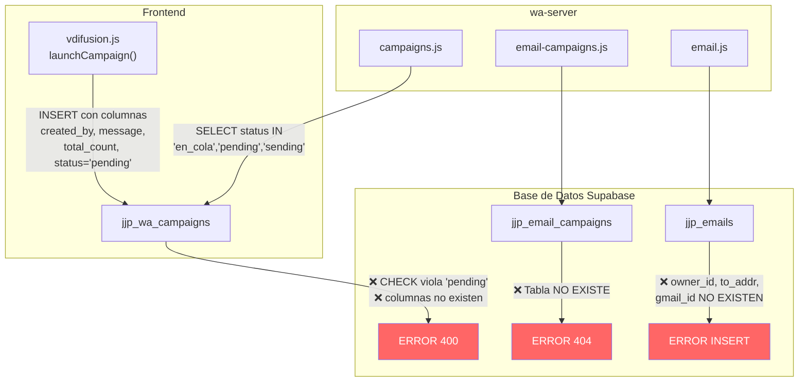

# 🔧 Plan de Reparación Integral — Backend, Comunicaciones y Campañas

> Diagnóstico completo tras analizar: cerebro del proyecto, 42 archivos SQL, `wa-server/src/` completo, frontend de difusión, correo y WhatsApp.

---

## 📋 Resumen del Diagnóstico

Se encontraron **4 categorías de problemas** que impiden que las campañas, el correo y los canales de comunicación funcionen correctamente:

| # | Categoría | Gravedad | Archivos afectados |
|---|-----------|----------|-------------------|
| 1 | **Desincronización de schema** (front envía columnas que la BD no tiene) | 🔴 Crítica | `vdifusion.js`, `jjp_wa_campaigns`, `jjp_emails` |
| 2 | **Tablas de email campaigns inexistentes** | 🔴 Crítica | `email-campaigns.js`, SQL |
| 3 | **Discrepancia de nombres de columnas** entre backend y BD | 🟠 Alta | `email.js`, `campaigns.js` |
| 4 | **CHECK constraints demasiado restrictivos** en la BD | 🟠 Alta | `jjp_wa_campaigns`, `jjp_wa_campaign_targets` |

---

## 🔴 PROBLEMA 1: El Front envía columnas que NO existen en la BD

### Hallazgo

En [vdifusion.js](file:///C:/Users/PC/Desktop/JJ%20PAPER/assets/js/vendedor/vdifusion.js#L620-L638), el frontend inserta campañas con estas columnas:

```js
// Líneas 620-638 de vdifusion.js
let payload = {
    owner_id: ownerId,
    created_by: ownerId,       // ❌ NO EXISTE en la tabla
    name,
    template_id: isRealUuid ? tpl.id : null,
    body: tpl.body,
    message: tpl.body,         // ❌ NO EXISTE (la tabla tiene 'body')
    status: 'pending',         // ⚠️ La tabla original solo acepta 'en_cola'
    total: list.length,
    total_count: list.length   // ❌ NO EXISTE (la tabla tiene 'total')
};

// Media (líneas 632-638):
payload.media_path = mediaPath;       // ⚠️ Solo existe si se ejecutó REPARACION_TOTAL
payload.media_type = mediaType;       // ⚠️ Solo existe si se ejecutó REPARACION_TOTAL
payload.media_mime = mediaMime;       // ⚠️ Solo existe si se ejecutó REPARACION_TOTAL
payload.media_filename = mediaFilename; // ⚠️ Solo existe si se ejecutó REPARACION_TOTAL
payload.media_size = mediaSize;       // ⚠️ Solo existe si se ejecutó REPARACION_TOTAL
```

### Esquema real de `jjp_wa_campaigns` según el SQL original ([2026-07-16-wa-difusion.sql](file:///C:/Users/PC/Desktop/JJ%20PAPER/sql/2026-07-16-wa-difusion.sql#L41-L59)):

| Columna que existe | Columna que el front envía | ¿Match? |
|---|---|---|
| `owner_id` | `owner_id` | ✅ |
| — | `created_by` | ❌ **NO EXISTE** |
| `name` | `name` | ✅ |
| `template_id` | `template_id` | ✅ |
| `body` | `body` | ✅ |
| — | `message` | ❌ **NO EXISTE** |
| `status` (CHECK: `en_cola,enviando,pausada,completada,cancelada`) | `status: 'pending'` | ❌ **Viola CHECK** |
| `total` | `total` | ✅ |
| — | `total_count` | ❌ **NO EXISTE** |
| — | `media_path` | ❌ Solo en REPARACION_TOTAL |
| — | `media_type` | ❌ Solo en REPARACION_TOTAL |
| — | `media_mime` | ❌ Solo en REPARACION_TOTAL |
| — | `media_filename` | ❌ Solo en REPARACION_TOTAL |
| — | `media_size` | ❌ Solo en REPARACION_TOTAL |

### Solución

**Opción A (la correcta):** Alinear front con BD + agregar columnas faltantes para media:

```sql
-- Agregar columnas de media que el front necesita
ALTER TABLE public.jjp_wa_campaigns
  ADD COLUMN IF NOT EXISTS created_by UUID,
  ADD COLUMN IF NOT EXISTS message TEXT,
  ADD COLUMN IF NOT EXISTS media_path TEXT,
  ADD COLUMN IF NOT EXISTS media_type TEXT DEFAULT 'text',
  ADD COLUMN IF NOT EXISTS media_mime TEXT,
  ADD COLUMN IF NOT EXISTS media_filename TEXT,
  ADD COLUMN IF NOT EXISTS media_size INTEGER;

-- Eliminar CHECKs restrictivos de status
ALTER TABLE public.jjp_wa_campaigns 
  DROP CONSTRAINT IF EXISTS jjp_wa_campaigns_status_check;
ALTER TABLE public.jjp_wa_campaign_targets 
  DROP CONSTRAINT IF EXISTS jjp_wa_campaign_targets_status_check;
```

**Y en el frontend**, eliminar `total_count` (redundante con `total`) y estandarizar `status`:

```js
// vdifusion.js — corregir payload (quitar total_count, usar status correcto)
let payload = {
    owner_id: ownerId,
    created_by: ownerId,
    name,
    template_id: isRealUuid ? tpl.id : null,
    body: tpl.body,
    message: tpl.body,
    status: 'en_cola',         // ← CORREGIDO
    total: list.length,
    // ELIMINADO: total_count
};
```

---

## 🔴 PROBLEMA 2: Tablas `jjp_email_campaigns` y `jjp_email_campaign_targets` NO EXISTEN

### Hallazgo

[email-campaigns.js](file:///C:/Users/PC/Desktop/JJ%20PAPER/wa-server/src/email-campaigns.js) (el backend) consulta estas tablas:

```js
// Línea 25-26
await db.from('jjp_email_campaigns').select('*').eq('status', 'running')
// Línea 45-46
await db.from('jjp_email_campaign_targets').select('*').eq('campaign_id', camp.id)
```

Pero al buscar en **todos los 42 archivos SQL**, la cadena `jjp_email_campaign` no aparece en **ninguno**. Estas tablas nunca fueron creadas.

### Solución

Crear las tablas con un SQL de migración:

```sql
-- Campañas de correo (misma estructura que WA campaigns)
CREATE TABLE IF NOT EXISTS public.jjp_email_campaigns (
  id            UUID PRIMARY KEY DEFAULT gen_random_uuid(),
  owner_id      UUID NOT NULL REFERENCES public.jjp_profiles(id) ON DELETE CASCADE,
  name          TEXT NOT NULL,
  subject       TEXT NOT NULL,
  body          TEXT NOT NULL,
  html          TEXT,
  attachments   JSONB DEFAULT '[]'::jsonb,
  status        TEXT NOT NULL DEFAULT 'pending'
                CHECK (status IN ('pending','running','paused','done','cancelled')),
  delay_min_s   INT NOT NULL DEFAULT 5 CHECK (delay_min_s >= 1),
  delay_max_s   INT NOT NULL DEFAULT 15 CHECK (delay_max_s >= delay_min_s),
  total         INT NOT NULL DEFAULT 0,
  sent_count    INT NOT NULL DEFAULT 0,
  failed_count  INT NOT NULL DEFAULT 0,
  started_at    TIMESTAMPTZ,
  finished_at   TIMESTAMPTZ,
  created_at    TIMESTAMPTZ NOT NULL DEFAULT now(),
  updated_at    TIMESTAMPTZ NOT NULL DEFAULT now()
);

CREATE TABLE IF NOT EXISTS public.jjp_email_campaign_targets (
  id            UUID PRIMARY KEY DEFAULT gen_random_uuid(),
  campaign_id   UUID NOT NULL REFERENCES public.jjp_email_campaigns(id) ON DELETE CASCADE,
  owner_id      UUID NOT NULL REFERENCES public.jjp_profiles(id) ON DELETE CASCADE,
  customer_id   UUID REFERENCES public.jjp_customers(id) ON DELETE SET NULL,
  to_addr       TEXT NOT NULL,
  name          TEXT,
  vars          JSONB NOT NULL DEFAULT '{}'::jsonb,
  status        TEXT NOT NULL DEFAULT 'pending'
                CHECK (status IN ('pending','sending','sent','failed','skipped')),
  email_id      UUID,
  error         TEXT,
  sent_at       TIMESTAMPTZ,
  created_at    TIMESTAMPTZ NOT NULL DEFAULT now()
);

-- RLS
ALTER TABLE public.jjp_email_campaigns ENABLE ROW LEVEL SECURITY;
CREATE POLICY ec_all ON public.jjp_email_campaigns FOR ALL TO authenticated
  USING (owner_id = auth.uid() OR public.jjp_is_admin())
  WITH CHECK (owner_id = auth.uid() OR public.jjp_is_admin());

ALTER TABLE public.jjp_email_campaign_targets ENABLE ROW LEVEL SECURITY;
CREATE POLICY ect_all ON public.jjp_email_campaign_targets FOR ALL TO authenticated
  USING (owner_id = auth.uid() OR public.jjp_is_admin())
  WITH CHECK (owner_id = auth.uid() OR public.jjp_is_admin());

-- Índices
CREATE INDEX IF NOT EXISTS jjp_ec_status ON public.jjp_email_campaigns (status);
CREATE INDEX IF NOT EXISTS jjp_ect_camp ON public.jjp_email_campaign_targets (campaign_id, status);

-- Realtime
ALTER PUBLICATION supabase_realtime ADD TABLE public.jjp_email_campaigns;
```

---

## 🟠 PROBLEMA 3: Discrepancia de nombres de columnas entre backend y BD

### 3A. `jjp_emails` — `owner_id` vs `profile_id`

El backend ([email.js](file:///C:/Users/PC/Desktop/JJ%20PAPER/wa-server/src/email.js#L320)) inserta correos entrantes con:

```js
// Línea 320 — email.js
owner_id: acct.profile_id, direction: 'in', status: 'received', ...
```

Pero [REPARACION_TOTAL](file:///C:/Users/PC/Desktop/JJ%20PAPER/sql/REPARACION_TOTAL_DEFINITIVA_COSTOS_DIFUSION_CORREO.sql#L329-L346) define la tabla con `profile_id`:

```sql
-- Línea 331
profile_id UUID REFERENCES public.jjp_profiles(id)
```

| Backend usa | SQL define | ¿Match? |
|---|---|---|
| `owner_id` | `profile_id` | ❌ |
| `to_addr` | `to_email` | ❌ |
| `from_addr` | `from_email` | ❌ |
| `body` | `body_text` | ❌ |
| `html` | `body_html` | ❌ |
| `gmail_id` | — | ❌ NO EXISTE |
| `thread_id` | — | ❌ NO EXISTE |
| `snippet` | — | ❌ NO EXISTE |
| `is_read` | `is_read` | ✅ |
| `retry_count` | — | ❌ NO EXISTE |
| `message_id` | — | ❌ NO EXISTE |

> [!CAUTION]
> Este es el problema más grave del módulo de correo. El backend usa nombres de columnas completamente diferentes a los que tiene la BD. Cada INSERT/UPDATE del server falla silenciosamente.

### Solución

Necesitamos decidir cuál es la fuente de verdad. El backend (`email.js`) es el código maduro y funcional — el SQL de reparación se hizo incorrectamente con otros nombres. **La BD debe alinearse al backend.**

```sql
-- Alinear jjp_emails con lo que espera email.js
ALTER TABLE public.jjp_emails
  ADD COLUMN IF NOT EXISTS owner_id    UUID REFERENCES public.jjp_profiles(id),
  ADD COLUMN IF NOT EXISTS to_addr     TEXT,
  ADD COLUMN IF NOT EXISTS from_addr   TEXT,
  ADD COLUMN IF NOT EXISTS body        TEXT,
  ADD COLUMN IF NOT EXISTS html        TEXT,
  ADD COLUMN IF NOT EXISTS gmail_id    TEXT,
  ADD COLUMN IF NOT EXISTS thread_id   TEXT,
  ADD COLUMN IF NOT EXISTS snippet     TEXT,
  ADD COLUMN IF NOT EXISTS retry_count INT DEFAULT 0,
  ADD COLUMN IF NOT EXISTS message_id  TEXT,
  ADD COLUMN IF NOT EXISTS attach_state TEXT DEFAULT 'none',
  ADD COLUMN IF NOT EXISTS campaign_id UUID;

-- Migrar datos de columnas viejas si existían
UPDATE public.jjp_emails SET owner_id = profile_id WHERE owner_id IS NULL AND profile_id IS NOT NULL;
UPDATE public.jjp_emails SET to_addr = to_email WHERE to_addr IS NULL AND to_email IS NOT NULL;
UPDATE public.jjp_emails SET from_addr = from_email WHERE from_addr IS NULL AND from_email IS NOT NULL;
UPDATE public.jjp_emails SET body = body_text WHERE body IS NULL AND body_text IS NOT NULL;
UPDATE public.jjp_emails SET html = body_html WHERE html IS NULL AND body_html IS NOT NULL;

CREATE INDEX IF NOT EXISTS jjp_emails_owner_dir ON public.jjp_emails (owner_id, direction);
CREATE INDEX IF NOT EXISTS jjp_emails_gmail_id ON public.jjp_emails (gmail_id) WHERE gmail_id IS NOT NULL;
```

### 3B. `jjp_wa_campaign_targets` — `owner_id` faltante en `countSentToday`

En [campaigns.js L194](file:///C:/Users/PC/Desktop/JJ%20PAPER/wa-server/src/campaigns.js#L190-L197):

```js
const { count } = await db.from('jjp_wa_campaign_targets')
    .select('id', { count: 'exact', head: true })
    .eq('owner_id', ownerId)    // ← necesita owner_id en targets
    .in('status', ['sent', 'enviado'])
    .gte('sent_at', midnight.toISOString());
```

La tabla `jjp_wa_campaign_targets` SÍ tiene `owner_id`, pero la consulta filtra por `status = 'sent'` mientras el SQL original define `CHECK (status IN ('pending','sent','failed','skipped'))`. El backend también usa `'enviado'` que NO está en el CHECK. **Hay que eliminar el CHECK o expandirlo.**

### 3C. `email-campaigns.js` — `owner_id` en `countSentToday` de email targets

[email-campaigns.js L139](file:///C:/Users/PC/Desktop/JJ%20PAPER/wa-server/src/email-campaigns.js#L135-L141):

```js
.eq('owner_id', ownerId)   // La tabla jjp_email_campaign_targets necesita owner_id
```

Cuando creemos la tabla, ya la incluimos (Problema 2 arriba).

---

## 🟠 PROBLEMA 4: CHECK constraints que bloquean la operación

### En `jjp_wa_campaigns`

El SQL original define:
```sql
CHECK (status IN ('en_cola','enviando','pausada','completada','cancelada'))
```

Pero el backend usa además: `'pending'`, `'sending'`, `'sent'`
Y el frontend envía: `'pending'`

### En `jjp_wa_campaign_targets`

El SQL original define:
```sql
CHECK (status IN ('pending','sent','failed','skipped'))
```

Pero el backend también busca: `'enviado'`, `'fallido'`, `'omitido'`, `'en_cola'`

### Solución

```sql
ALTER TABLE public.jjp_wa_campaigns DROP CONSTRAINT IF EXISTS jjp_wa_campaigns_status_check;
ALTER TABLE public.jjp_wa_campaigns DROP CONSTRAINT IF EXISTS jjp_wa_campaigns_kind_check;
ALTER TABLE public.jjp_wa_campaign_targets DROP CONSTRAINT IF EXISTS jjp_wa_campaign_targets_status_check;
```

---

## 📊 Resumen Visual del Flujo Roto



---

## 🚀 Plan de Ejecución (Orden exacto)

### Fase 1 — SQL de reparación definitiva (ejecutar en Supabase SQL Editor)

| Paso | Qué hace | Prioridad |
|------|----------|-----------|
| 1.1 | Eliminar CHECKs restrictivos de campaigns y targets | 🔴 |
| 1.2 | Agregar columnas faltantes a `jjp_wa_campaigns` (created_by, message, media_*) | 🔴 |
| 1.3 | Crear tablas `jjp_email_campaigns` + `jjp_email_campaign_targets` | 🔴 |
| 1.4 | Alinear `jjp_emails` (agregar owner_id, to_addr, from_addr, body, html, gmail_id, thread_id, snippet, retry_count, message_id, campaign_id) | 🔴 |
| 1.5 | Agregar al Realtime las tablas nuevas | 🟡 |
| 1.6 | `NOTIFY pgrst, 'reload schema'` | 🔴 |

### Fase 2 — Correcciones en el frontend

| Paso | Qué hace | Archivo |
|------|----------|---------|
| 2.1 | Quitar `total_count` del payload de `launchCampaign()` | `vdifusion.js` |
| 2.2 | Usar `status: 'en_cola'` en vez de `'pending'` como primer intento (o quitar el retry logic) | `vdifusion.js` |
| 2.3 | Quitar la lógica de "reintento inteligente" que borra media_* | `vdifusion.js` |

### Fase 3 — Verificación del servidor

| Paso | Qué hace |
|------|----------|
| 3.1 | Reiniciar wa-server (`START-SERVIDOR.bat`) |
| 3.2 | Verificar en logs que aparezca: "realtime outbox", "módulo correo activo", "heartbeat + control activos" |
| 3.3 | Verificar que `jjp_server_control.heartbeat_at` se actualice cada 20s |
| 3.4 | Crear una campaña de prueba desde el panel y verificar que `campaigns.js` la detecte |

### Fase 4 — Tests de integración

| Test | Cómo verificar |
|------|----------------|
| Crear campaña WhatsApp | Panel → Difusión → Nueva campaña → ver en `jjp_wa_campaigns` |
| Despacho de campaña | El wa-server debe mover targets de `pending` → `sent` |
| Crear campaña de correo | Insertar en `jjp_email_campaigns` → `email-campaigns.js` la detecta |
| Envío de correo normal | Panel Correo → Enviar → ver en `jjp_emails.status = 'sent'` |
| Recepción de correo | `pollInbound()` trae entrantes → aparecen en el panel |

---

## 📁 Script SQL Consolidado

> [!IMPORTANT]
> El script SQL definitivo se generará como siguiente paso. Contiene TODAS las correcciones de la Fase 1 en un solo archivo listo para ejecutar en Supabase.

¿Aprobamos este plan y procedemos a generar el SQL + las correcciones de código?
