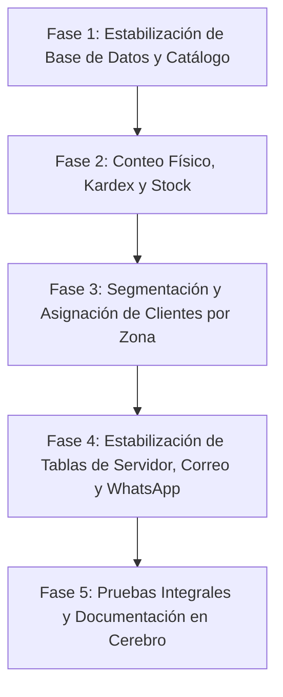

# 📋 Plan Maestro de Recuperación y Estabilización del Sistema — JJ Paper

> **Fecha:** 25 de Agosto de 2026  
> **Proyecto Supabase Destino:** `czzvsqnmxtjzqzioknnn`  
> **Estado General:** En Diagnóstico y Planificación Estructurada  
> **Prioridad:** 🔴 Crítica Operativa

---

## 🔍 1. Diagnóstico de Causas Raíz (¿Qué está fallando y por qué?)

A partir del análisis del código, el cerebro del proyecto (`cerebro/`), las notas de sesiones previas (`Sesiones/2026-08-24.md`) y el registro del servidor `wa-server/logs/server.log`, se identificaron con precisión los siguientes puntos de falla:

| Área / Función | Causa Raíz Identificada (Errores del Log y Schema) | Impacto Operativo |
|---|---|---|
| **1. Catálogo Web (`catalogo.html` / `vcatalogo.js`)** | Faltan columnas y tablas del catálogo estructurado (`jjp_category_groups`, columna `essential` en `jjp_products`, columna `group_id` en `jjp_categories`). Cuando el frontend hace el `SELECT` con joins a grupos, Supabase responde `400 Bad Request` y la pantalla queda vacía. | El sitio web público y el catálogo del vendedor no muestran ningún producto. |
| **2. Inventario, Conteo y Bitácora (`admin/conteo.html`, `admin/inventario.html`)** | No se han ejecutado las definiciones SQL de las tablas y vistas del conteo (`jjp_count_tally`, `jjp_barcode_log`, `jjp_stock_moves`, vistas `jjp_count_valued` y funciones `jjp_count_add`/`set`). | Falla la bitácora de escaneo, no se registran conteos y el inventario no refleja datos. |
| **3. Cartera de Clientes y Vendedores (`admin/clientes.html`, RLS)** | Los clientes existen en `jjp_customers` (1,811 registros), pero la mayoría tiene `seller_id = NULL` o las políticas RLS no filtran adecuadamente por el `auth.uid()` del vendedor activo según su zona (004, 006, 008, 014). | Todos los clientes aparecen en cualquier usuario sin segmentación por vendedor. |
| **4. Módulo de Correo y Tablas del Servidor (`email.js` / `server.log`)** | En los logs: `Could not find the table 'public.jjp_emails' in the schema cache`, `Could not find the table 'public.jjp_server_control'`, `jjp_wa_campaigns`, `jjp_invoice_alerts`. Además, tokens OAuth revocados en Gmail API. | Error continuo 500 en el servidor, no envía ni sincroniza correos. |
| **5. WhatsApp CRM y Control (`wa-session.js` / `wa-link.js`)** | Falta la tabla `jjp_server_control` y `jjp_wa_campaigns` en la nueva base de datos, lo que hace fallar el heartbeat del server cada 10s. | Inestabilidad del servidor y pérdida de persistencia del estado. |

---

## 🛠️ 2. Plan de Ejecución por Fases y Prioridad

---

### 🔴 FASE 1: Estabilización Estructural de Supabase y Catálogo Web (Prioridad 1)
**Objetivo:** Restaurar el catálogo web tanto para el público como para el POS y cotizador de vendedores.

1. **Ejecutar Migración de Familias y Grupos de Catálogo:**
   - Script: `sql/2026-07-16-catalog-groups.sql`.
   - Crea: `jjp_category_groups`, añade `group_id` a `jjp_categories` y `essential` a `jjp_products`.
   - Asigna las 39 categorías a sus 8 familias principales y activa los productos esenciales.
2. **Verificación de Productos y Variantes:**
   - Verificar integridad de los 601 productos y variantes en `jjp_products` y `jjp_product_variants` con `sku`, `price_usd` y `base_price_usd`.
3. **Validación Frontend:**
   - Comprobar que `catalogo.html`, `pos.html` y `cotizador.html` carguen sin errores 400 en la consola del navegador.

---

### 🔴 FASE 2: Reactivación de Inventario, Conteo Físico y Bitácora (Prioridad 2)
**Objetivo:** Habilitar el módulo de escaneo, control de conteo por deltas, bitácora y movimientos de kardex.

1. **Ejecutar Migración de Conteo y Kardex:**
   - Script: `sql/SOLO_LO_NECESARIO.sql` (contiene tablas `jjp_count_tally`, `jjp_barcode_log`, `jjp_stock_moves`, `jjp_seller_prices`, vistas `jjp_count_valued`, `jjp_count_totals`, `jjp_barcode_dupes` y RPCs `jjp_count_add`, `jjp_count_set`, `jjp_barcode_assign`).
2. **Habilitar Funciones de Búsqueda por SKU / Código de Barras:**
   - Ejecutar `sql/2026-07-18-sku-bridge.sql` y `sql/2026-07-18-scan-events.sql`.
3. **Validación de Bitácora y Conteo:**
   - Probar en `admin/conteo.html` y `vendedor/scan.html` la lectura y registro en vivo de escaneos y valorizaciones en USD/Bs.

---

### 🟡 FASE 3: Segmentación y Asignación de Clientes por Zona a Vendedores (Prioridad 3)
**Objetivo:** Asegurar que cada vendedor solo vea y gestione a los clientes de su zona asignada, manteniendo el admin con visión global.

1. **Mapeo de Vendedores y Zonas:**
   - **Zona 008** → Marianela
   - **Zona 014** → Andreina
   - **Zona 006** y **Zona 004** → Giovanni
2. **Ejecución del Script de Actualización de Cartera:**
   - Vincular los perfiles en `jjp_profiles` (identificando los `id` de Marianela, Andreina y Giovanni) con sus clientes en `jjp_customers` basándose en la columna `zone` ya cargada (o mediante el script `cargar_clientes.mjs` / `clientes_procesados_zonas.csv`).
3. **Aplicación de Políticas RLS Estrictas:**
   - Confirmar en `jjp_customers` la política:
     - `ADMIN`: Acceso total (lectura/escritura de todos los clientes).
     - `VENDEDOR`: `SELECT / UPDATE` restringido a `seller_id = auth.uid()`.

---

### 🟡 FASE 4: Sincronización del Servidor Backend (`wa-server`), Correo y WhatsApp (Prioridad 4)
**Objetivo:** Crear tablas faltantes del backend (`jjp_emails`, `jjp_server_control`, `jjp_wa_campaigns`, `jjp_invoice_alerts`), eliminar errores en bucle y levantar el enlace de WhatsApp.

1. **Crear Tablas Faltantes del Servidor en Supabase:**
   - Ejecutar la sección de CRM, emails y control (`sql/2026-07-whatsapp-crm.sql`, `sql/2026-07-26-integraciones.sql`, `sql/2026-07-26-factura-fiscal.sql` y `sql/2026-07-23-fx-rates-history.sql`).
   - Esto soluciona los errores `Could not find table public.jjp_emails`, `public.jjp_server_control`, `public.jjp_wa_campaigns` y `public.jjp_fx_rates` reportados en los logs.
2. **Resolución de Autenticación de Correo (OAuth Gmail):**
   - Guiar o refrescar la vinculación OAuth de las cuentas de correo desde `admin/correo.html` para renovar los `refresh_tokens` revocados.
3. **Estabilización de Sesión de WhatsApp:**
   - Asegurar que la tabla `jjp_wa_sessions` en la nueva DB mantenga los registros limpios.
   - Vincular el número de WhatsApp principal escaneando el código QR generado en `admin/whatsapp.html`.
4. **Monitoreo de Heartbeat y Mixer:**
   - Comprobar que el servicio local (`mixer.js` y `count-lan.js`) corra en los puertos correspondientes (8787 / 8788) reportando a `jjp_server_control`.

---

### 🟢 FASE 5: Pruebas Integrales, Blindaje y Documentación Persistente (Prioridad 5)
**Objetivo:** Garantizar que cualquier nuevo reinicio o agente cuente con el contexto 100% actualizado.

1. **Pruebas de Flujo Completo (Punta a Punta):**
   - Catálogo público $\rightarrow$ Agregar al carrito $\rightarrow$ Enviar cotización / pedido.
   - Vendedor $\rightarrow$ Iniciar sesión $\rightarrow$ Ver solo sus clientes de zona $\rightarrow$ Escaneo de inventario $\rightarrow$ Reflejo en bitácora.
2. **Actualización de Archivos del Cerebro:**
   - Registrar la sesión en `cerebro/Sesiones/2026-08-25.md`.
   - Actualizar `cerebro/Proyecto/Historia.md` y `cerebro/Proyecto/Pendientes.md`.
   - Mantener actualizado `AGENTS.md`.

---

## 🛡️ Protocolo Anti-Errores y Reglas de Trabajo
- **Regla de Oro:** No inventar esquemas nuevos ni modificar lógica funcional del front; el frontend ya está construido y probado. La base de datos debe adaptarse al contrato exacto que el front ya consume.
- **Transparencia en ejecución:** Cada script SQL a aplicar será documentado con su motivo e impacto antes de ejecutarse.
