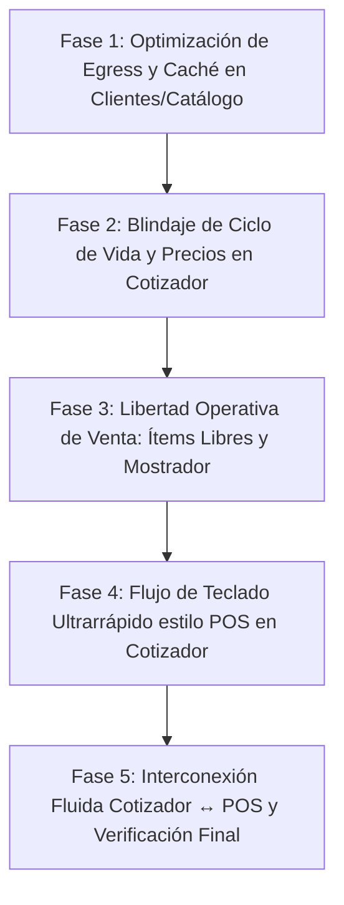

# 📋 Plan Maestro Integral: Optimización Crítica de Egress + Blindaje de Cotizaciones & Experiencia POS

**Fecha:** 22-09-2026  
**Objetivo Primordial:** Respetar la regla fundacional de **"Cuidar y Proteger la Base de Datos"** (detener el consumo excesivo de cuota/egress en Supabase Core) y, sobre esa base optimizada y ágil, implementar la **libertad operativa, atajos de teclado e interconexión fluida entre Cotizador y POS**.

---

## 1. 🎯 Diagnóstico y Conexión de Ambos Problemas

Hasta el momento, los módulos de Cotizaciones y POS han sufrido una doble crisis:
1. **Crisis de Experiencia y Flujo de Ventas:**
   - Fallos de guardado por inconsistencias en esquemas (`updated_at` inexistente en `jjp_quotes`).
   - Bloqueo de estados (`editingQuoteId` zombie sobreescribiendo cotizaciones previas).
   - Pérdida de niveles de precio (A/B/C/D) por inconsistencia en claves de variants.
   - Rigidez de mostrador (catálogo 100% cerrado sin ítems libres y teléfono obligatorio).
2. **Crisis Oculta de Rendimiento y Egress (Violación a las Reglas del Sistema):**
   - **Falta total de caché en Clientes:** Se descargan más de 3.665 registros masivamente con `SELECT *` y paginación en cada pequeña acción (guardar un cliente, asignarlo, recargar).
   - **Doble carga de Catálogo:** `catalog.js` y `product-finder.js` (`pfLoad`) hacen consultas independientes y pesadas de 1.800+ variantes.
   - **Consultas infladas:** `quotes.js` y `correo.js` bajan payloads masivos con `SELECT *` (incluyendo cuerpos HTML y JSON de ítems en bandejas de lista).

👉 **Solución Integral:** Diseñar e implementar las soluciones en fases ordenadas. Primero blindamos y optimizamos el consumo de datos (Egress), lo que a su vez hará que el Cotizador y POS vuelen en velocidad (<50ms de respuesta local), y luego activamos el nuevo flujo ágil de teclado, ítems libres y pase directo.

---

## 2. 🗺️ Fases del Plan de Implementación

---

### 🔹 FASE 1: Reducción Radical de Egress y Optimización de Lecturas (BD Sana)

*Esta fase elimina el 60-80% del desperdicio de datos mensual antes de tocar la lógica comercial.*

1. **Caché Inteligente de Clientes con Revalidación en Memoria (`sessionStorage`):**
   - **Archivos:** `assets/js/vendedor/vcustomers.js` y `assets/js/admin/aclients.js`.
   - Implementar `jjp_customers_cache_v1` con TTL de 5 a 10 minutos (similar al esquema de éxito de `catalog.js`).
   - **Actualización reactiva local (Zero Egress Re-fetch):**
     - Al crear, editar o asignar un cliente (`claimCustomer`, `saveCustomer`): en lugar de llamar a `loadCustomers()` para bajar los 3.665 clientes de nuevo, **se actualiza o inserta el objeto en el array local en memoria** y se refresca el caché.
2. **Cirugía de Columnas en Consultas Masivas (Fin al `SELECT *` destructivo):**
   - Restringir la carga de clientes a las columnas que realmente renderizan las tablas y autocompletados:
     `id, name, phone, rif, zone, city, total_orders, total_usd, last_order_at, seller_id, email, address, notes, tags`.
   - En `assets/js/admin/quotes.js` (lista general): reemplazar `SELECT *` por columnas de resumen (`id, quote_number, client_name, phone, city, estimated_total_usd, discount_pct, status, source, created_at, customer_id`). Solo pedir `items` y `notes` en el modal de detalle o al cargar para edición.
   - En `assets/js/admin/correo.js`: no solicitar `html` ni `body` en el listado de los 100 correos principales (solo `id, direction, status, is_read, from_addr, to_addr, subject, snippet, attachments, attach_state, error, created_at`). El cuerpo completo se descarga bajo demanda al abrir el correo (`mailOpen`).
3. **Unificación y Reutilización de Catálogo (`pfLoad`):**
   - Conectar `product-finder.js` con el almacenamiento temporal de `sessionStorage` para evitar re-descargas completas al alternar entre POS, Cotizador y Stock.

---

### 🔹 FASE 2: Blindaje del Ciclo de Vida y Precios en Cotizaciones

*Corrige los 4 errores técnicos de raíz detectados en la auditoría del día 21.*

1. **Eliminación de Columnas Fantasma en Supabase:**
   - En `assets/js/vendedor/vquotes.js`, asegurar que en `update` o `insert` sobre `jjp_quotes` jamás se envíe `updated_at` (columna inexistente en su DDL).
2. **Erradicación del Estado Zombie (`editingQuoteId`):**
   - En `quoteReset()`, al guardar exitosamente o al hacer clic en *"Nueva cotización / Cancelar"*:
     - Resetear obligatoriamente: `editingQuoteId = null`, `editingQuoteNumber = null`.
     - Restaurar el texto del botón a `"📋 Guardar Cotización"`.
     - Limpiar la URL sin recargar pantalla (`history.replaceState({}, '', location.pathname)`).
     - Ocultar banner de edición.
3. **Reconciliación de Claves y Niveles de Precio (A/B/C/D):**
   - En `loadQuoteForEdit(id)`, unificar las claves del ticket bajo el estándar `${product_id}::${variant_id}`.
   - Cruzar los ítems guardados contra el catálogo en memoria (`posProducts`) para re-inyectar `price_a`, `price_b`, `price_c_bs`, `price_d_bs`, `stock` y `min_qty`. Al editar, los botones A/B/C/D funcionarán inmediatamente sin alertas de falta de precio.
4. **Persistencia del Descuento:**
   - Corregir el ID del elemento del DOM en `loadQuoteForEdit` a `qDisc` para que el porcentaje de descuento se cargue y preserve con total fidelidad.

---

### 🔹 FASE 3: Libertad Total de Venta y Mostrador (Admin y Vendedor)

*Elimina la rigidez operativa que frenaba las ventas en producción.*

1. **Módulo de "➕ Ítem Libre / Personalizado" (Cotizador y POS):**
   - Botón directo y atajo de teclado (`F8` o `Alt+I`).
   - Modal rápido o fila en blanco: *Descripción libre, Cantidad, Precio en USD o Bs, Unidad de medida*.
   - Los ítems libres se guardan en el JSON `items` con `is_custom: true` y sin exigir SKU ni ID de variante.
   - Tanto el ticket, el totalizador, el comprobante PDF/impreso y la pre-factura de WhatsApp aceptarán y calcularán estos ítems transparentemente.
2. **Cliente Rápido de Mostrador / Consumidor Final:**
   - Botón de 1 toque: `⚡ Consumidor Final / Mostrador`.
   - Auto-rellena: Nombre: "Consumidor Final", Teléfono: opcional/omitido, RIF: "V-00000000".
   - Flexibilizar la validación de cotización: no exigir teléfono obligatorio en mostrador si el cliente solicita solo un presupuesto rápido para llevar en papel.

---

### 🔹 FASE 4: Flujo de Teclado Ultrarrápido estilo POS en Cotizador

*Lleva la velocidad alcanzada en el POS al módulo de Cotizaciones.*

1. **Adición Directa sin Ventanas Emergentes:**
   - Al presionar `Enter` en el buscador de productos del cotizador: agregar automáticamente a precio oficial (B), enfocar el ticket para ajustar cantidad o pasar al siguiente producto, eliminando popups intrusivos.
2. **Navegación Secuencial por Tabulador (`posNavTab`):**
   - Flujo lineal intuitivo: `Buscador (F2)` ➔ `Cliente (F3)` ➔ `Descuento (F4)` ➔ `Notas` ➔ `Guardar (F9)`.
3. **Modo Edición Rápida en Ticket (`F6` / `Alt+T`):**
   - Subir y bajar entre filas con `↑ / ↓`.
   - Modificar cantidades con `+ / -`.
   - Cambiar niveles de precio presionando las teclas `A`, `B`, `C` o `D`.
   - Borrar ítem con tecla `Supr` / `Delete`.
4. **Escape Universal:**
   - Si hay modales o menús abiertos, cerrarlos; si el buscador tiene texto, limpiarlo; si está limpio, volver al foco inicial.

---

### 🔹 FASE 5: Interconexión Fluida Cotizador ↔ POS y Verificación

1. **Pase Directo Cotización ➔ POS:**
   - Al terminar de guardar una cotización o desde la tabla de cotizaciones: botón de acción directa `🛍️ Cobrar en POS`.
   - Abre `pos.html?quote=COT-XXXX` o inyecta directamente el cliente, ítems, niveles de precio aplicados y descuentos en el ticket del POS.
2. **Carga Inversa en POS (`F11`):**
   - Atajo `F11` en POS para abrir modal de cotizaciones pendientes y absorberlas en el ticket de caja al instante.
3. **Marcado Automático de Estado:**
   - Al concretar el cobro en POS de una cotización cargada, marcar automáticamente su estado en Supabase como `'convertido'`.
4. **Acceso Rápido a Edición:**
   - Botón `✏️ Editar` directo en cada fila de las tablas en `admin/cotizaciones.html` y `vendedor/cotizaciones.html`.

---

## 3. 🧪 Protocolo de Pruebas y Validación (Cero Errores)

| Prueba | Acción | Criterio de Éxito |
| :--- | :--- | :--- |
| **1. Auditoría Network (Egress)** | Navegar entre Clientes, POS y Cotizador | Inspeccionar pestaña Red (DevTools): Cero peticiones repetidas de 3.665 filas; tiempos de carga < 50ms por `sessionStorage`. |
| **2. Creación de Cotización** | Crear cotización usando atajos de teclado y cliente rápido | Guarda en Supabase sin error 400 (`updated_at` ausente) y genera número `COT-YYMMDD-XXXX`. |
| **3. Edición Fiel (`?edit=ID`)** | Abrir cotización existente, cambiar nivel a C o D y modificar descuento | Preserva número original, botones A/B/C/D responden sin toast de error, y no duplica filas en BD. |
| **4. Blindaje Anti-Zombi** | Tras guardar o cancelar edición, pulsar "Nueva cotización" | La interfaz y memoria quedan 100% limpias; la siguiente venta se guarda como registro nuevo sin tocar el anterior. |
| **5. Ítems Libres** | Agregar flete o ítem no catalogado | Calcula total, descuenta y aparece detallado en el ticket y en `comprobante.html`. |
| **6. Conversión Cotizador ➔ POS** | Pasar cotización al POS mediante botón o `F11` | Carga ticket idéntico en POS y al cobrar cambia el status a `convertido`. |

---

## 📌 Estado del Documento
- **Archivo persistido en Cerebro:** [`cerebro/Sesiones/PLAN_EGRESS_Y_COTIZADOR_POS.md`](file:///C:/Users/PC/Desktop/JJ%20PAPER/cerebro/Sesiones/PLAN_EGRESS_Y_COTIZADOR_POS.md).
- **Listo para aprobación:** Tras tu visto bueno, arrancamos directamente con la ejecución secuencial.
