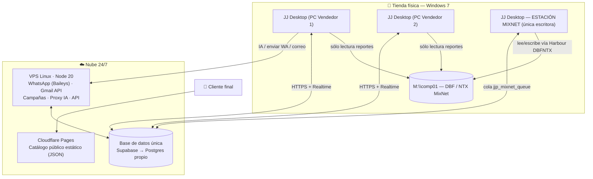
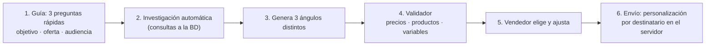
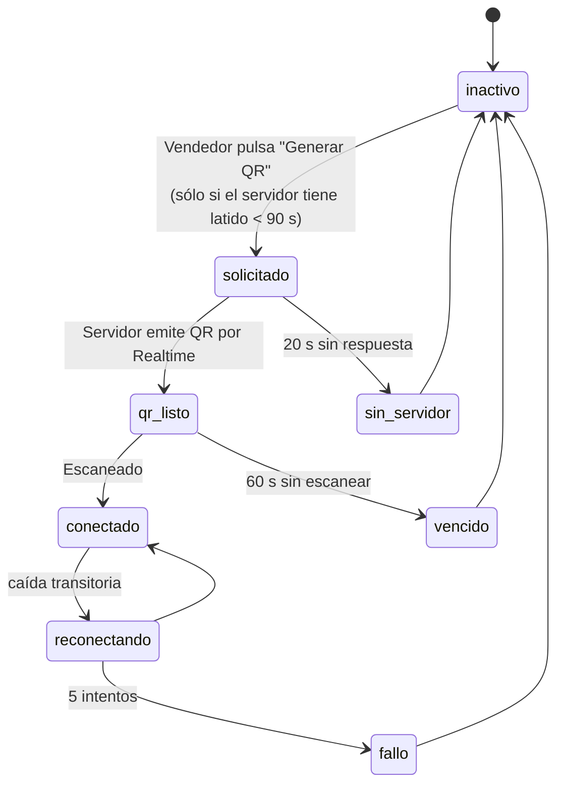
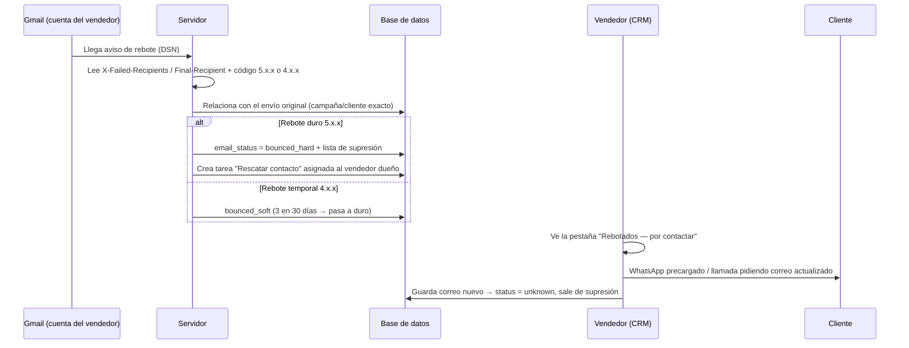
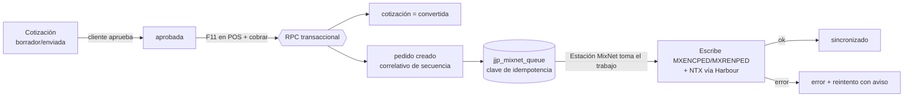

# 🏗️ PLAN DE IMPLEMENTACIÓN INTEGRAL v2 — JJ PAPER
**Fecha:** 03-10-2026 · **Estado:** 📋 Propuesta (sin tocar código) · **Reemplaza y amplía:** `PLAN_REESTRUCTURACION_MAESTRO_2026-10-03.md` (4 fases)

> [!IMPORTANT]
> **Regla rectora:** *Primero se arregla, después se muda.* Nada se sube al VPS hasta que cada módulo pase sus criterios de aceptación en local. Mudar el sistema actual tal cual sólo trasladaría los mismos fallos a otro servidor.

---

## 0. Principios de diseño (aplican a todas las fases)

| # | Principio | Qué significa en la práctica |
|---|---|---|
| P1 | **Una sola verdad por dato** | Un solo `DataService` en el frontend; ninguna página hace consultas propias "por su cuenta". |
| P2 | **Cero sondeo ciego** | Nada de `setInterval` contra la BD. Se usan eventos (Realtime / colas) y, si hay que sondear, con retroceso progresivo y pausa cuando la ventana está oculta. |
| P3 | **Las reglas viven en el servidor** | Supresión de rebotes, opt-out, cooldown, límites diarios y claves de IA se validan en el servidor, no sólo en el navegador. |
| P4 | **Guardar sólo lo que se usa** | No se importan meses de historial de WhatsApp, ni grupos, ni HTML viejo de correos. Todo con retención configurable. |
| P5 | **Columnas explícitas** | Prohibido `select('*')`. Cada consulta pide exactamente lo que pinta. |
| P6 | **Código portable** | El mismo HTML/JS sirve para la web (Cloudflare) y para la app de escritorio. Cambiar de Supabase a Postgres propio = cambiar un solo adaptador. |
| P7 | **Protocolo MixNet intacto** | CODVEN sagrado, escritura sin huellas, `.NTX` actualizado por Harbour/DBFNTX, una sola estación escritora. |

---

## 1. Diagnóstico NUEVO verificado en el código (segunda auditoría)

Estos hallazgos **no estaban** en el plan de 4 fases y fueron comprobados leyendo los archivos:

### 🔴 H1 — Las 7 claves de Gemini están publicadas en internet
- [gemini-client.js L28-L35](file:///C:/Users/PC/Desktop/JJ%20PAPER/assets/js/gemini-client.js#L28-L35): el pool de 7 claves está en un archivo JS que Cloudflare Pages sirve públicamente. Cualquiera que abra el catálogo puede copiarlas y agotar la cuota (explica parte de los 429 "sin motivo").
- `mixnet-ai-panel` repite el mismo pool.
- **Solución:** proxy de IA en el servidor (`/ai/*`) con límite por usuario; las claves sólo en `.env` del servidor. Rotar las 7 claves al migrar.

### 🔴 H2 — El redactor IA de campañas ignora la mitad de lo que eliges y siempre escribe lo mismo
- [campaign-editor.js L2642-L2656](file:///C:/Users/PC/Desktop/JJ%20PAPER/assets/js/vendedor/campaign-editor.js#L2642-L2656) envía `targetSector` y `valueHook`, pero [`draftCampaignMessage`](file:///C:/Users/PC/Desktop/JJ%20PAPER/assets/js/gemini-client.js#L864-L875) **no los recibe** → los selectores "Sector" y "Gancho de valor" de la vista previa no hacen nada.
- El prompt ([L897-L956](file:///C:/Users/PC/Desktop/JJ%20PAPER/assets/js/gemini-client.js#L897-L956)) dicta **frases literales** (título, intro, ventajas, CTA, firma). La IA sólo puede copiar la plantilla → mensajes idénticos.
- No consulta nada antes de redactar: ni historial de compras del segmento, ni campañas anteriores, ni stock.
- El *fallback* cuando la IA falla es una plantilla fija igual a la anterior.
- El Spintax sólo varía el saludo; el cuerpo es el mismo para los 500 destinatarios.

### 🔴 H3 — WhatsApp descarga meses de historial al escanear el QR
- [wa-session.js L288](file:///C:/Users/PC/Desktop/JJ%20PAPER/wa-server/src/wa-session.js#L288): `syncFullHistory: true` → WhatsApp envía TODO el historial disponible.
- [`onHistory` L561-L623](file:///C:/Users/PC/Desktop/JJ%20PAPER/wa-server/src/wa-session.js#L561-L623): no hay corte por fecha ni por cantidad; por cada contacto nuevo hace un `upsertChat` individual y luego un `update` por chat → miles de peticiones seguidas. Así se llegó a **102.759 mensajes / 43 MB**.
- Cada mensaje insertado dispara Realtime hacia los navegadores abiertos → el frontend también "explota".

### 🔴 H4 — Los rebotes de email usan dos vocabularios distintos
- El servidor escribe `email_status = 'bounced'` ([email.js L522](file:///C:/Users/PC/Desktop/JJ%20PAPER/wa-server/src/email.js#L520-L531), `email-campaigns.js L140`).
- El frontend busca `'bounced_hard'` / `'bounced_soft'` (CRM `vcustomers.js L150/L281`, filtros de `vcampanas-email.js L512`).
- **Consecuencia:** los rebotes reales **no aparecen** en el botón de rescate del CRM ni en el contador "omitidos por rebote"; sólo los frena la lista de supresión del servidor.
- [email.js L508](file:///C:/Users/PC/Desktop/JJ%20PAPER/wa-server/src/email.js#L508): toma **el primer email que aparezca en el cuerpo** del rebote. Puede marcar como rebotado el correo del propio vendedor o el de `mailer-daemon`. No distingue rebote duro (5.x.x) de temporal (4.x.x).
- No existe un flujo de "¿y ahora qué hago con este cliente?": el rebote queda marcado y nadie lo atiende.

### 🟠 H5 — Tráfico basura en el frontend (censo real)
| Métrica | Cantidad | Peores archivos |
|---|---|---|
| `setInterval(` activos | **18** | `wa-chat.js` (vigilante del compositor cada 3 s, L61), `phone-dialer.js`, `vllamadas`, `inv-scan.js`, `promos.js` |
| `select('*')` | **51** | `monitor-client.js` (8), `count-control.js` (6), `wa-chat.js` (4), `vdifusion.js` (4) |
| Canales Realtime | **14** | Varios por página sin cerrar al salir |

### 🟠 H6 — Páginas que dependen de la PC Supervisor (ya no existe)
`admin/lan.html`, `admin/monitor.html`, `mixnet-ai-panel` (apunta a `192.168.0.172:8787`), `admin/llamadas.html` + `vendedor/llamadas.html` (GSM/ADB desconectado). Siguen cargándose y generando errores.

### 🟡 H7 — Consultas N+1 en campañas
`campaigns.js L152` y `email-campaigns.js L55/L71`: por **cada destinatario** se hacen 2 consultas extra (opt-out + supresión). Una campaña de 1.000 = 2.000 consultas adicionales. Debe precargarse en lote.

### Resumen de las 8 fracturas previas (ya documentadas)
Proyecto B sin auth/RLS abierto · tablas fantasma · índices inflados en `jjp_emails` · heartbeat doble *(corregido)* · polling QR 3 s *(corregido)* · GSM 4 s *(corregido)* · 102k mensajes sin purga · correlativos aleatorios *(corregido)*.

---

## 2. Arquitectura objetivo

### 2.1 JJ Desktop — la aplicación instalada en cada PC
| Aspecto | Decisión | Por qué |
|---|---|---|
| Tecnología | **Electron 22.3.x** (32 y 64 bits) | Es la **última versión que soporta Windows 7**. Trae Chromium 108 + Node 16 (mucho mejor que el Node 13 actual) y permite reutilizar el 100 % del HTML/JS existente. |
| Contenido | Las mismas páginas del sistema empaquetadas localmente | Arranque instantáneo, sin depender de que cargue Cloudflare. |
| Caché local | SQLite/IndexedDB con catálogo + cartera del vendedor | Sincronización por **delta** (`updated_at > última_sync`) en lugar de descargar 5.600 clientes cada vez. |
| Modo sin internet | Catálogo, consulta de precios y borradores de cotización funcionan offline; se encolan y suben al volver la red | La tienda no se paraliza si cae el internet. |
| MixNet | Módulo integrado. **Una sola PC marcada como "Estación MixNet"** escribe pedidos; las demás sólo leen reportes (facturación, CxC, inventario) | Dos procesos escribiendo el mismo DBF = corrupción de índices. |
| Actualizaciones | Auto-update desde GitHub Releases | Cero visitas a cada PC para actualizar. |
| Seguridad | `contextIsolation`, sin `nodeIntegration` en las páginas, sólo dominios permitidos | Electron 22 ya no recibe parches → se compensa cerrando la superficie. |
| Requisito Win7 | SP1 + actualizaciones KB4474419 (SHA-2) y KB2533623 | Sin ellas no instala Node 16/Electron. Se verifica en el instalador. |

### 2.2 VPS — sólo cuando todo esté sano (Fase 8)
- Node 20 LTS, `systemd` o `pm2`, un único proceso con candado de sesión en BD (evita el doble socket "Bad MAC").
- Funciones: WhatsApp, Gmail API, motor de campañas, **proxy de IA**, endpoint de salud (reemplaza `monitor.html`/`lan.html`).
- Tamaño sugerido: 2 vCPU / 4 GB si sólo corre Node; 4 vCPU / 8 GB si además aloja Postgres/Supabase propio.
- Respaldo nocturno (`pg_dump` + sesiones Baileys cifradas).

### 2.3 Base de datos — camino hacia Postgres propio
| Etapa | Acción |
|---|---|
| Ahora (Fase 2) | **Unificar Proyecto A y B en uno solo** (A ya tiene auth y 11 perfiles). Se elimina el Proxy de enrutamiento de `config.js`, el RLS abierto de B y los huérfanos por teléfono. El egress que motivó la separación venía de los bugs, no del diseño. |
| Fase 9 (opcional) | Migrar a **Supabase self-hosted en el VPS** (Docker: Postgres + Auth + Realtime + Storage). Ventaja: el código del frontend **no cambia** (mismo `supabase-js`). Alternativa más liviana: Postgres + PostgREST + API propia (más trabajo). |
| Garantía | Gracias a `DataService` (P6), el cambio de proveedor toca un solo archivo. |

---

## 3. Plan por módulo (páginas que permanecen)

| Página | Problema actual | Qué se hará | Criterio de aceptación |
|---|---|---|---|
| **Catálogo para clientes** | Consulta la BD en cada visita | Catálogo **estático**: JSON regenerado al cambiar precios/productos, servido por Cloudflare | 0 consultas a la BD por visitante; carga < 1 s |
| **Cotizador** | IA pre-armado frágil, duplicidad con POS | Pre-armado vía proxy IA + fallback heurístico (regex "20 resmas") ; estados `borrador → enviada → aprobada → convertida / vencida` | Pre-armado < 3 s; nunca queda en blanco si la IA falla |
| **POS / Ventas** | Carga cotización a mano | `F11` absorbe la cotización completa; al cobrar, cotización → `convertida` y pedido creado **en una sola transacción (RPC)** | Imposible tener cotización convertida sin pedido o viceversa |
| **Pedidos / Cotizaciones** | Lecturas pesadas | Listas paginadas con columnas explícitas; estado MixNet visible (`pendiente / sincronizado / facturado / error`) | Lista de 50 en < 300 ms |
| **CRM Clientes** | Descarga masiva, rebotes invisibles | Caché delta; nueva pestaña **"Rebotados — por contactar"** (ver §6) | Rebotes visibles el mismo día |
| **Prospectos B2B** | OK funcional | Mismo DataService; análisis IA vía proxy | — |
| **WhatsApp (chats)** | `select('*')`, vigilante 3 s, historial masivo | Columnas explícitas, paginación, 1 canal Realtime por usuario, sin vigilantes | < 30 peticiones/hora en reposo por usuario |
| **Difusión WA** | Mensaje repetitivo, N+1 | Redactor IA v2 (§4), personalización en servidor, precarga de opt-outs | 1 consulta de precarga por campaña, no por destinatario |
| **Correo (bandeja)** | Sondeo cada 2 min con lista | Gmail **History API** (sólo cambios desde el último `historyId`); estado del token visible con botón "Reconectar" | Tokens vencidos se detectan y avisan, no fallan en silencio |
| **Campañas Email** | Rebotes mal clasificados | Vocabulario unificado + límite diario por cuenta en servidor | 0 envíos a direcciones `bounced_hard` |
| **Productos / Precios / Listas / Marcas / Unidades** | Funcional | Al guardar, se regenera el catálogo estático y se invalida caché | — |
| **Inventario / Conteo** | `select('*')` (6) | Columnas explícitas | — |
| **Facturas / Reportes MixNet** | Dependían de la Supervisor | Se leen **localmente** en JJ Desktop desde la red de la tienda; a la nube sólo suben resúmenes diarios | Reportes disponibles sin internet |
| **Vendedores / Ajustes** | — | Ajustes nuevos: días de historial WA, retención, cooldown, límite diario de correo, estación MixNet | — |

### ❌ Se eliminan
Reseñas · Promociones · Carrito/checkout · `lan.html` y `monitor.html` (sustituidos por panel de salud del servidor) · tablas `jjp_reviews`, `jjp_promos`, `jjp_clients` (fusionada) · referencias a `jjp_pos_scans`.
**Pendiente de tu decisión:** Llamadas (GSM).

---

## 4. Redactor IA de campañas v2

**Paso 2 — qué consulta antes de redactar:**
- Datos exactos del artículo: nombre, marca, presentación/empaque, stock, precio según nivel (A/B/C/D) del segmento, USD y Bs a tasa BCV.
- Perfil del segmento: sectores predominantes (colegios, oficinas, comercios), categorías más compradas por ese segmento en `jjp_orders`.
- Las **últimas 5 campañas** enviadas a esa audiencia → se pasan como "NO repitas estas aperturas ni estructuras".
- Temporada (ej. temporada escolar, cierre de año).

**Paso 3 — tres ángulos con estructura distinta:** ahorro por volumen · disponibilidad/urgencia · solución para el sector. El vendedor escoge.

**Formato obligatorio (contrato, no frases fijas):**
1. **Título en negrita** con el gancho de la oferta.
2. Saludo personalizado (`{{nombre}}`, `{{empresa}}`).
3. **Artículo detallado**: *Nombre* (presentación, marca) — *$USD* | Bs.
4. **Propuesta comercial** a la empresa: condición, escala por volumen, despacho.
5. Llamado a la acción concreto.
6. Firma del vendedor.

**Cambios técnicos:**
- Recibir y usar `targetSector`, `valueHook` y `tone` (hoy se pierden).
- Prompt basado en **reglas + ejemplos rotativos**, no en frases literales; temperatura 0,85 para redacción creativa.
- Validador posterior: rechaza precios que no coincidan con el catálogo, productos omitidos o variables rotas.
- Personalización por destinatario en el servidor (variables + spintax + adaptación por sector cacheada, para no gastar cuota por cada cliente).
- Fallback: en vez de una plantilla fija, combina bloques intercambiables (varias aperturas/cierres) para que tampoco se repita.

---

## 5. Sincronización de WhatsApp v2

| Cambio | Detalle |
|---|---|
| Historial limitado | `syncFullHistory: false` + filtro `shouldSyncHistoryMessage`. Corte configurable `wa_history_days` (por defecto **7 días**, máx. 30) y tope de 50 mensajes por chat. |
| Sólo chats útiles | Del historial se importan chats cuyo teléfono coincide con cliente/prospecto o con actividad reciente. Grupos, estados y canales: nunca. |
| Escritura en lote | Un solo `upsert` masivo de chats y una RPC para actualizar las vistas previas (hoy: 1 petición por chat). |
| Media | Historial sin media; media nueva en Storage con TTL de 30 días. |
| QR sin sondeo | El QR llega por Realtime/Broadcast; el navegador no consulta la tabla en bucle. Si el servidor no tiene latido, el botón dice "Servidor fuera de línea" en vez de quedarse esperando. |
| Retención | Purga automática de mensajes > 90 días (configurable) + `VACUUM`. Limpieza inicial de los 102.759 actuales. |
| Una sola sesión | Candado de sesión en la BD ("lease") además del mutex por puerto, para que nunca haya dos servidores con el mismo número. |

---

## 6. Rebotes de email v2 — a dónde van y cómo se recupera al cliente

- **Vocabulario único:** `valid · unknown · bounced_soft · bounced_hard · complained · opt_out`. Migración: todo `'bounced'` actual → `'bounced_hard'`.
- **Lectura correcta del rebote:** nunca "el primer email del texto"; se excluyen las cuentas propias y `mailer-daemon`.
- **El rebote sí se atiende:** tarea al vendedor dueño, con botones WhatsApp / Llamar / Editar correo. Si el cliente tiene WhatsApp válido, entra automáticamente en la audiencia nativa "Email rebotado" de Difusión (regla de unificación de datos).
- **Límite diario por cuenta Gmail** aplicado en el servidor (≈ 500/día cuentas normales).

---

## 7. Flujo comercial: Cotización → POS → Pedido → MixNet

- Correlativos desde una **secuencia de Postgres** dentro de la transacción; la Estación MixNet concilia con `MXNUMPED/MXNUMCOT` antes de escribir.
- Cada pedido lleva **clave de idempotencia** → jamás se escribe dos veces en MixNet aunque se reintente.
- Protocolo MixNet obligatorio: CODVEN del vendedor real, `COMEN1/COMEN2` en blanco si no hay notas, cliente no registrado → código `00` "CUENTA RECUPERADA", leer el manual de reparación antes de tocar DBF.

---

## 8. Higiene de datos y latencia

| Acción | Meta |
|---|---|
| `DataService` único con columnas explícitas y caché delta | 51 → 0 `select('*')` |
| Auditoría de los 18 `setInterval` → eventos o retroceso + pausa en pestaña oculta | ≤ 3 temporizadores, ninguno contra la BD |
| 1 canal Realtime por usuario (multiplexado) | 14 → ≤ 3 canales |
| Precarga en lote de opt-outs/supresión en campañas | –2 consultas por destinatario |
| `REINDEX jjp_emails` + borrar índices sin uso (`idx_scan = 0`) | 61 MB → ~5 MB |
| Catálogo público estático | 0 consultas por visitante |
| **KPI global** | < 60 peticiones/hora por usuario en reposo; crecimiento de BD < 50 MB/mes |

---

## 9. Fases de ejecución

| Fase | Objetivo | Entregables clave | Riesgo |
|:---:|---|---|:---:|
| **0** ✅ | Parar rebotes de red | Backoff QR, GSM, heartbeat único, correlativo determinista | — |
| **1** | Limpieza y contratos de datos | Purga de páginas/tablas muertas, `DataService`, columnas explícitas, auditoría de temporizadores, vocabulario de `email_status` | 🟢 |
| **2** | BD única y seguridad | Unificar A+B, RLS correcto, proxy de IA, rotar las 7 claves | 🟡 |
| **3** | WhatsApp v2 | Historial limitado, escritura en lote, máquina de estados del QR, retención y limpieza inicial | 🟡 |
| **4** | Correo y rebotes v2 | Parser DSN, rescate de contactos, History API, salud de tokens OAuth, límite diario | 🟡 |
| **5** | Redactor IA v2 + motor de campañas | Guía + investigación + 3 ángulos + validador; personalización en servidor; fin del N+1 | 🟢 |
| **6** | Flujo comercial | RPC cotización→pedido, secuencias, `jjp_mixnet_queue` con idempotencia | 🟡 |
| **7** | JJ Desktop (Windows 7) | Electron 22 32/64 bits, caché local, modo offline, Estación MixNet con Harbour/DBFNTX, auto-update | 🟠 |
| **8** | Mudanza al VPS | Node 20 + systemd, candado de sesión, respaldos, panel de salud. **Sólo con Fases 1-7 aprobadas** | 🟡 |
| **9** *(opcional)* | Postgres propio | Supabase self-hosted en VPS; cambio de adaptador en `DataService` | 🟠 |

> [!NOTE]
> Mientras no exista el VPS, el servidor de WhatsApp/correo puede correr temporalmente en cualquier PC con Windows 10/11 para las pruebas de Fases 3-5. Las PCs con Windows 7 **nunca** corren Baileys.

---

## 10. Decisiones que necesito de ti

1. **¿Unificamos Proyecto A y B en una sola base?** (recomendado).
2. **Llamadas (GSM):** ¿se elimina o se conserva para el futuro?
3. **Historial de WhatsApp a importar al vincular:** 7 días (recomendado) o 30.
4. **Cuántas PCs de tienda** tendrán JJ Desktop y **cuál será la Estación MixNet** (la única que escribe pedidos).
5. **¿Aceptas Electron 22** (última versión compatible con Windows 7, sin parches de seguridad nuevos, mitigado con aislamiento)?
6. **VPS:** proveedor/presupuesto (define si alojamos también la BD propia o sólo el servidor Node).
